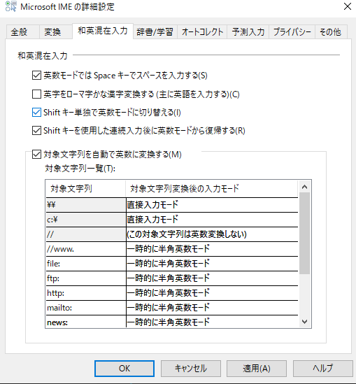

# IME設定でできるキーボード効率化～Windows～

ごまなつと申します。キーバインド設定で快適なキーボード操作をするお手伝いをいたします。今回は、意外と知られていないIME設定でのキーボード入力効率化について解説します。デフォルトでインストールされているMicrosoft IMEと、google日本語入力について解説します。

# IMEとは？
IME(Input Method Editor)は、直訳すると入力方法エディターです。日本語を入力するときは、ひらがなを入力し、それを漢字などを含む文章に変換します。この変換の役割を担うのがIMEです。代表的なものはデフォルトでインストールされているMicrosoftIME、Google日本語入力、ATOKです。

# 右クリックメニュー
通知領域の「あ」または「A」を右クリックします。


## IMEパッド
一番左のリストから、上から順に説明していきます。

漢字の形は覚えているけど、読み方がわからないから変換できなくて入力できないよ、という経験は誰しもあると思います。そこで便利なのが手書き機能です。マウスで文字を書くと、自動認識して予測された漢字が左に表示されます。クリックで入力できます。

リスト2つ目は文字一覧画面です。Unicodeの文字が一覧表示されます。クリックで入力できます。


リスト3つ目はソフトキーボードです。入力したい文字をクリックで入力できます。このときのみ、4つ目、5つ目の総画数、部首がリストから消え、下の<<をクリックで開けます。


リスト4つ目は総画数画面です。画数を指定すると、その画数の漢字が一覧表示されます。クリックで入力できます。フォントを指定できます。


リスト5つ目は部首画面です。部首の画数を指定して、部首を指定すると、その部首の漢字が一覧表示されます。クリックで入力できます。フォントを指定できます。

どの画面でも右に表示されているBSなどのボタンも、クリックでそのキーを入力できます。

## 単語の登録

変換候補に表示される内容に、登録したものを表示させることができます。例えば、単語に「以上、よろしくお願いいたします。」を入力し、よみに「めーるぶんまつ」を入力、登録すると、「めーるぶんまつ」を入力すると「以上、よろしくお願いいたします。」が変換候補に表示されます。予測変換が有効な場合は、もっと早く表示されるかもしれません。必要に応じて、ユーザーコメント、品詞を指定することでより便利に使用できます。よみに指定できるのは、ひらがな、英数字、記号です。

## ユーザ辞書ツール

単語の登録で登録した設定がここで表示されます。これらをまとめてユーザ辞書と呼びます。この画面では、登録されている設定をエクスポートしたり、インポートすることができます。また、単語の登録、削除、変更することもできます。ここでエクスポートされるファイルは拡張子が.dicです。ほかのIMEで作成したユーザ辞書の場合はテキストファイルである可能性があります。そのときは「ツール」→「テキストファイルからの登録」で登録することができます。テキストファイルの形式は、以下の通りです。読み、語句、品詞の順にTabやSpaceで区切りを入れて並べてください。１行ずつ読み込まれます。

```
めーるぶんまつ  以上、よろしくお願いいたします。    名詞
えくせる    Excel   名詞
ざびえる    フランシスコ・ザビエル  人名
よこはま    神奈川県横浜市  地名その他
めがばいと  MB  固有名詞
```

「編集」→「新規登録」で上記の単語の登録が開きます。

## 追加辞書サービス

「追加辞書サービス」→「辞書の設定」で「プロパティ」→「詳細設定」→「辞書/学習」が開きます。ここでシステム辞書の追加・削除ができます。

### ユーザ辞書とシステム辞書の違い
「ツール」→「システム辞書の作成」があります。前項ではユーザ辞書について説明しました。何が違うのでしょうか。ユーザ辞書は、内容の登録、変更、削除ができますがシステム辞書は一旦作成したら内容の変更ができません。また、システム辞書の追加はこの画面ではなく「プロパティ」→「詳細設定」→「辞書/学習」のシステム辞書から追加・削除を行います。ユーザ辞書は1つしか読み込めませんが、システム辞書は最大15個読み込むことができます。システム辞書は、辞書のように単語を指定するのが良いでしょう。短縮して入力したいものは、ユーザ辞書が良いでしょう。

## プロパティ

予測入力では、入力履歴を使用するか、入力履歴の消去が行えます。誤変換では、誤変換データの自動的な送信のON/OFFを設定できます。誤変換データは自動的にMicrosoftに送信されています。これを認めるかを指定します。IME入力モード切替の通知では、IMEを切り替えたときに画面中央に表示されるA(半角英数モード)とあ(ひらがな入力モード)を表示するかしないかを設定できます。
詳細設定では、IMEの詳細設定ができます。上記で説明した画面にも、詳細設定から開くことができます。

### 全般

入力設定では、ローマ字入力かかな入力か設定したり、句読点を「,.」に変更したり、記号で「」・を入力するキーを[]/に設定したり、スペースで入力される文字やテンキーで入力するキーを常に全角・常に半角に変更できます。句読点と記号は変更すると入力できなくなるキーが存在します(「,.」に変更すると全角でも全角の「，．」が入力され、「、。」が入力できなくなる)。これは、変換することで入力できます。

#### 編集操作
キー設定の「変更」で、次の画面が開きます。

Space、Ctrl、Shift、Backspace、Enter、Fキーといったショートカットに使われるキーの組み合わせでの操作を指定することができます。キーの組み合わせ、操作ともに用意されているものしか用意できません。ここでは、MacからWindowsに乗り換えた人を想定して、IME切り替えがMacと同じ位置になるように無変換キーが英数、変換キーがかなに対応するように変更してみます。*キーの列から「無変換」を探し、一つ隣の「入力/変換済み文字なし」をダブルクリックします。次の画面が開きます

開いた画面から「IME- オフ」を選択し、OKをクリックします。同様に、「変換」も「IME- オン」に変更します。ここで、入力/変換済み文字なしとは何なのか説明します。これは、文字を入力して確定するまでのどのタイミングかを示しています。左から順に、「入力/変換済み文字なし」、「入力文字のみ」、「変換済み」、「候補一覧表示中」、「文節長変更中」、「変換済み文節内入力文字」です。

タイミングは順に「何もしていない状態」、「入力して変換していない状態」、「変換して確定してない状態」、「変換候補一覧表示状態」、「変換文節変更中」、「変換中に文字を入力したり再変換した状態」です。ですので、今回は「何もしていない状態」でIMEの状態を変更したいので「入力/変換済み文字なし」を変更しました。

筆者は過去に英字キーボードを使っていた関係上、IME切り替えをCtrl+Spaceで行っていたため日本語キーボードでもCtrl+SpaceにIME切り替えを割り当てています。

#### ローマ字/色の設定
ローマ字設定の「変更」をクリックします。

どの英字を入力するとローマ字変換してひらがなを入力するのかを設定できます。この表はローマ字テーブルと呼ばれることもあります。項目操作の「追加」をクリックすると、次の画面が表示されます。

ローマ字に入力する英字、ひらがなに入力したいひらがなを入力し、OKをクリックしてOKか適用を押すと設定できます。試しにローマ字に「q」、ひらがなに「ざ」を入力してOKし、OKしてください。すると、ひらがな入力状態でqを入力すると「ざ」が入力されます。小指で連続入力するのはつらいので、この設定は意外と便利です。いろいろな発想でカスタマイズしてみてください。

色設定の「変更」をクリックします。

変換するとき、下線が出ます。変換前は点線、変換後の変換中の文節は太い実線、変換済みは実線、文節長変更中は青背景に白抜き文字になります。この設定を変更できます。先ほど説明したものはデフォルト設定です。文字色、背景色、下線の種類、下線色が変更できます。15色とシステムで使われている色が選択できるので、興味ある方は変更してみてください。

キー設定、ローマ字設定、色設定画面はそれぞれ開いた画面のタブを切り替えることでも表示されます。

### 変換

この画面に関しては、説明で内容が理解できると思うので割愛します。詳細設定を開くと、次の画面が表示されます。


変換文字制限について説明します。IVS(Ideographic Variation Sequence)とは、文字符号としては同一視される漢字の、細かな字形の差異を特別に使い分けるための仕組みです。複数の字形に対して一つの共通な符号（コード）を与える場合があり、それらを区別するための仕組みです。

サロゲートペアとは、Unicodeに登録される文字が増えていった結果、従来の2バイトでは文字が足りない状況になり、考案された仕組みです。1文字=2バイトの基本を維持しつつ、一部の文字は1文字=4バイトにします。この一部の文字をサロゲートペアと呼びます。4バイトですので、8文字になるかと思いきや独自の変換規則に従わせて5文字になります。

### 和英混在入力

デフォルトでは設定されていない2つを説明します。「英字をローマ字かな漢字変換する（主に英語を入力する）」では、英字を直接ローマ字やかな、漢字に変換できるようになります。「Shiftキー単独で英数モードに切り替える」では、Shiftキー単独押しがIMEキーと同じ動作になります。「対象文字列を自動で英数に変換する」では、ある単語を入力した際に自動で設定した英数に変換できます。辞書の逆ですね。

### 辞書/学習
