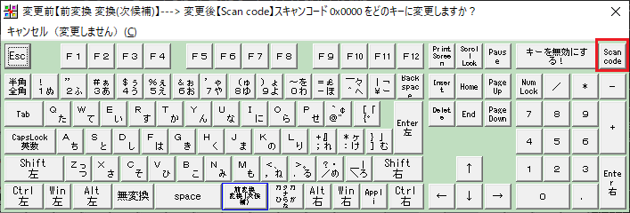
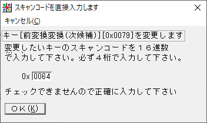

# (記事タイトル)AutoHotKeyにおけるエラー～押しっぱなし問題とScrollLockの非推奨～
ごまなつと申します。キーバインド設定で快適なキーボード操作をするお手伝いをいたします。
前々回の記事では、WindowsにおいてChangeKeyとAutoHotKeyを用いたキーバインド設定を紹介しました。トリガーキーとしてScrollLockをお勧めしましたが、私が遭遇した現象から非推奨とします。現象の解説として、押しっぱなし問題とトグルキーの扱いを解説します。

# AutoHotKeyのキー押しっぱなし問題
AutoHotKeyは、キーを押す（Down）とキーを離す（Up）を送信することでキー入力を実現するものです。Downしたあと、Upを送信できないと押しっぱなしになります。この押しっぱなしがs修飾キーで起こってしまうことがあります。

例えば、Ctrl+SpaceでEnterを入力する処理では、AutoHotKeyのkey historyでは次のようになります。dがDown、uがUpです。

```
d LControl
d Space
u LControl
d Enter    ←AutoHotKeyによる挿入
u Enter    ←AutoHotKeyによる挿入
d LControl
u Space
u LControl
```

となります。EnterキーをDownしてUpする処理をAutoHotKeyが挿入しています。このような処理において、

```
d LControl
d Space
u LControl
d Enter     ←AutoHotKeyによる挿入
u Enter     ←AutoHotKeyによる挿入
d LControl
u Space
//ここで物理的にCtrlキーを離しているが、u LControlが感知されていないため、Lcontrolが押しっぱなしになる 
```

最後にCtrlキーを物理的に離しているにもかかわらず、離した操作が感知されていないため押しっぱなしになります。こうなると、全てのキー入力にCtrlキーとの同時押しが適用されてしまいます。

# 原因は何か？
推測ではありますが、AutoHotKeyが処理を行っている間に物理的にキーを離してしまうと、キーを離した処理を感知していないのだと考えられます。例で挙げたような処理であれば軽い処理なのでめったに起こりませんが、何らかの重い処理をすると起こる可能性があります。文字変換の決定に用いたり、多数のキーを同時押ししたときなどです。

# 解決策
これを解決するには,

- Sendではなく、SendInputを用いる
- Sleepを挟む

といった方法があります。ですが、SendInputを用いるとSendとは挙動が違う部分が多いため、解決すべき点が増えます。よって、Sleepを挟むのが良いでしょう。Sleepはミリ秒を指定します。2ミリ秒といった短い時間でも十分なことがほとんどです。

```
LControl & Space::Send, {Blind}{Enter}
Sleep, 2
Return
```

# もっと簡単な解決法
押しっぱなしになって困るのであれば、押しっぱなしになっても困らないキーを使えばよいですよね。ということで、F13～F24キーを用いる方法があります。

## F13～F24キーとは？
初めて聞いた人も多いのではないでしょうか。現在はFキー（ファンクションキー）はF1～F12までがキーボードに搭載されています。実は昔のキーボードには倍のF1～F24キーが存在したのです。現在ではF13～F24キーには何の操作も割り当てられていませんが、F13～F24キーを押すことは可能です。F13を押すにはShift+F1、F14を押すにはShift+F2というようにShift+Fキーで12を足したキーを送信できます。

# ChangeKeyでF13～F24キーを押す
トリガーキーを押すためにいちいちShift+Fキーを押すのは面倒ですよね。そこで、以前キー入力を変更するために用いたChangeKeyを使って、F13～F24キーを押しましょう。変更したいキーをクリックすると、次の画面が出ます。変更後のキーを選ぶわけですが、F13～F24が存在しません。よって、スキャンコードを用います。右上のScanCodeをクリックしてください。

クリックした後のこの画面で、入力したScanCodeを送信するようになります。スキャンコードは、コンピュータ内部でキーを判別するための数値です。F13～F24は、以下のようになります。


|キー | スキャンコード|
----|----
|F13|0x0064|
|F14|0x0065|
|F15|0x0066|
|F16|0x0067|
|F17|0x0068|
|F18|0x0069|
|F19|0x006A|
|F20|0x006B|
|F21|0x006C|
|F22|0x006D|
|F23|0x006E|
|F24|0x0076|


次の図では、F13キー(0x0064)を指定しています。



このF13を変換キーに指定して、キーバインドのトリガーとして使いましょう。以前の記事のコードを採用した場合は、

- ChangeKeyでScrollLockに変更していたキーを指定したFキーに変更
- AutoHotKeyのコードでScrollLockの部分を指定したFキーに変更

という処理をしてください。

# 筆者がScrollLockを非推奨にした理由
以前の記事ではScrollLockをトリガーにすることを提案しましたが、筆者の環境では不具合が起こりました。先ほど説明した、押しっぱなし問題がScrollLockキーで発生してしまったためでした。ScrollLockキーをトリガーとして、押してすぐ離すとBackSpace、押しっぱなしだとキーバインドのトリガーキーとしてScrollLockを送信していました。次のコードです。

```
ScrollLock::
    KeyWait, ScrollLock, T0.5
if ErrorLevel == 1  
  	Send, {ScrollLock}
	else
    	Send,{BS}
Return
```

ScrollLockが押されたら、0.5秒待って、押しっぱなしだったらScrollLockを送信、そうでなければBackSpaceを送信するコードです。これを用いた状態でScrollLock押しっぱなし現象が起こりました。ScrollLockキーは押すことでON/OFFを切り替えるキーです。ONの状態で押しっぱなしになると、ScrollLockを押しても一回押されている処理が挟まるのでOFFにすることができません。そして、ONのままだとScrollLockが短時間だけ入力されてしまうことがあります。そのため、何もしていないのにBackSpaceが押されるという現象が起こります。

# まとめ
本記事では、筆者が遭遇した押しっぱなし問題とトグルキーの挙動と解決法について解説しました。以前ScrollLockをトリガーキーとして用いるように紹介しましたが、使わないでください。本当に使われていないキーはF13～F24キーです。押しっぱなし問題は、なにかおかしいな？と思った時に思い出せるように頭の片隅に置いておくと良いです。

