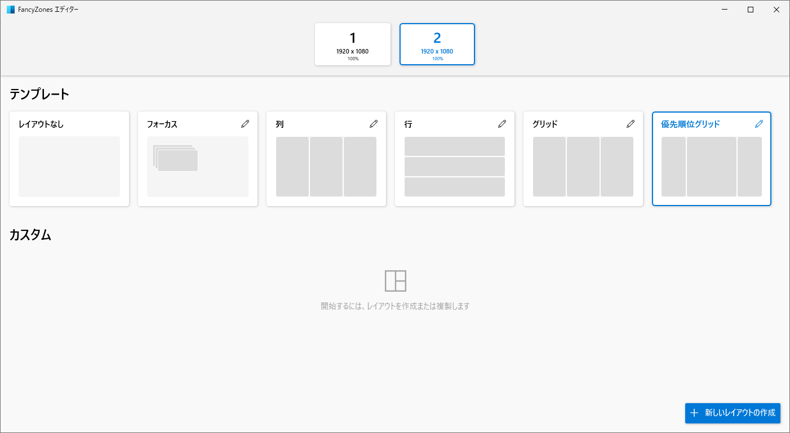
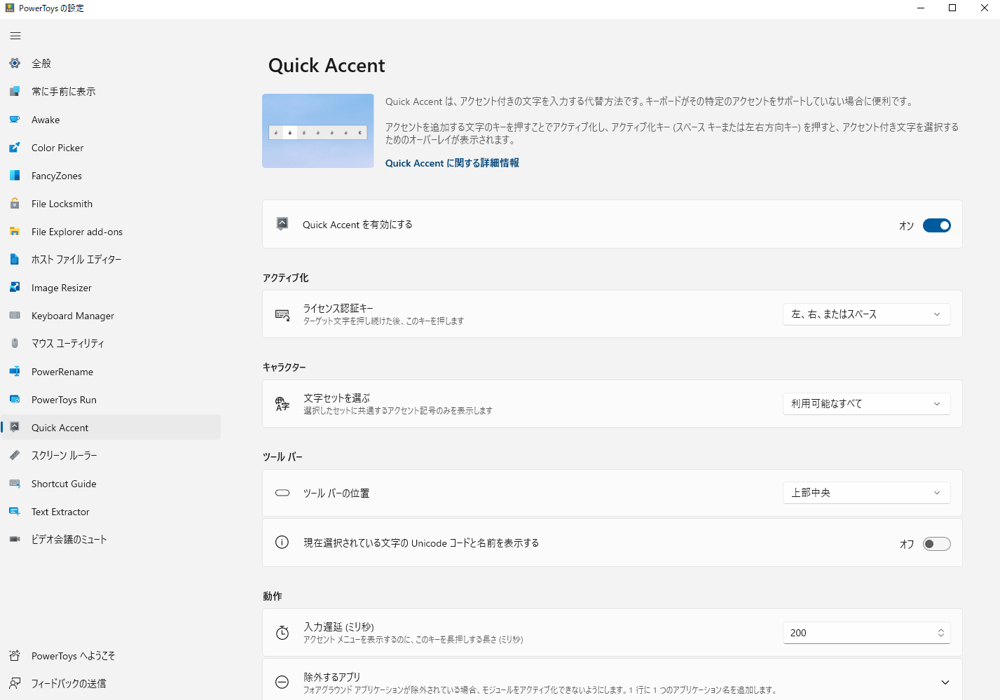

# 記事タイトル：Windowsの便利ツールPowerToysの紹介

ごまなつと申します。WindowsよりもMacの方が便利ツール多くて便利だと思っていませんか。ですが、WindowsもMacに負けじと便利ツールを公式が開発しているのをご存じでしたか？代表的なものだと、クイックランチャーがWindowsで使えたり、カラーピッカー、簡易OCR、マウスカーソル位置検索などができます。

このような機能を実現するのが、Windows公式がOSSで開発している「PowerToys」です。現時点でも開発が進められているため、2022年11月にも新機能が追加されました。

# PowerToysとは

PowerToysは、Microsoftが開発中しているOSSです。元々Windowsに搭載するはずでしたが搭載されなかった利便性向上機能を複数提供するソフトです。

　実は元々Windows 95時代から存在しているソフトで、Windows XPまで提供が続けられていました。Vista以降は提供されていませんでしたが、2019年5月にWindows10向けにオープンソースとして提供が再開されました。

OSSであるため、随時新機能が追加されたり変更があることがありますが2022年12月時点(v0.65.0)での機能を紹介します。

公式の説明資料は（https://docs.microsoft.com/ja-jp/windows/powertoys/）にあります。詳しい説明が知りたい方は参照してください。また、それぞれの機能の設定画面のトップに詳細情報へのリンクがあります。

# PowerToysへようこそ

PowerToysを開くとこのような画面が出ます。

左下の「PowerToysへようこそ」をクリックしてください。

この画面では、各機能の簡単な紹介と各機能の設定画面へのリンクが張られたボタンが表示されます。今回は各機能を紹介するため割愛しますが、各機能がどのような機能だったかわからなくなった時に確認すると便利です。

ここからは、各機能の紹介をしていきます。それぞれ、共通で「[機能名]を有効にする」項目があります。有効にしないとその機能は有効になりません。自分が使いたい機能だけ有効にしましょう。また、それぞれの機能にアクティブ化のショートカットがあり、押したときに作動します。加えて、特定アプリの操作中には作動してほしくない場合には、除外するアプリを設定できる機能で設定できます。

# Awake
PCを起動したままにする機能です。スリープモードを無効化するためには設定画面の電源プランで設定するのですが、簡単な設定ができます。

モードは、選択した電源プランを引き続き使用する、無期限に起動したままにする、一時的に起動したままにするの３つがあります。一時的に起動したままにするにすると、前の起動状態に戻るまでの時間が表示され、設定できます。画面をオンにしたままにするかどうかも設定できます。

# Color Picker
現在実行中のアプリケーションから色を選択し、構成可能な形式でクリップボードにコピーすることができます。アクティブ化のショートカットで設定したキーを押すと、現在のマウスポインタがさしている場所の色を表示する、以下の表示が出ます。例として、PowerToysの設定の余白部分を指しています。

vscodeのダークモードを指すと黒が表示されます。この状態でクリックすると、エディタが表示されます。

選択した色が左に表示され、上のバーをクリックすると色をスライドバーで編集できます。左は履歴表示になっているため、編集した色や選択した色が表示されていきます。今回はColor Pickerの設定画面でアクティブ化の動作を「色を選択してエディターを開く」にしているためこのような動作ですが、「エディターを開く」だと直接エディターが開き、「色の選択」にするとエディターがクリックしても開かなくなります。

ピッカーの動作で既定の色の形式を選択できます。CMYK、HEX、HSB、HSI、HSL、HSV、HWB、Ncol、RGB、CIE LAB、CIE XYZ、VEC4、Decimalから選択できます。「色の名前を表示」をオフにするとピッカーの時に色が表示されなくなります。

エディターでは、エディターに表示される色の形式と、その順序を変更できます。

# FileLockSmith
選択したファイルがどのプロセスで使われているか確認できます。１つまたは複数のファイルを選択して右クリックし、コンテキストメニューから「このファイルは何で使用していますか」をクリックします。するとウィンドウが立ち上がり、ファイルを使用しているプロセスを確認できます。

# FancyZones
この機能は、複数のウィンドウを開いて作業を行うときの場所決めを支援する機能です。Windowsに標準搭載されているタスクビューやWindows+矢印キーでウィンドウを移動させる機能の強化版をイメージすると分かりやすいです。レイアウトエディターで設定したレイアウトにウィンドウの位置とサイズを設定します。

エディターの「レイアウトエディタの起動」をクリックするか、「アクティブ化のショートカット」で設定したキーをクリックすると、レイアウトエディターが開きます。

テンプレートで満足できるならこちらを選択し、自分好みの設定をしたいなら新しいレイアウトの作成をクリックします。位置やサイズ、項目の数を自由に設定できます。

ではこのレイアウトにどうやって変更するのか。ウィンドウをShiftキーを押しながらドラッグします。ドラッグすると設定したレイアウトが透過表示され、その位置にドラッグすることで自動でサイズ調整されます。

ほかには、ゾーンが複数モニターにまたがることを許可したり、Shiftを押しながらドラッグしたときゾーンの外観を変更できたり、画面の解像度が変更されたときにウィンドウをゾーンに保持したりなどの設定もできます。

最初に説明したWindows+矢印キーでは２分割しかできないですが、「Windowsスナップのオーバーライド」をオンにするとWindows+矢印キーでも設定したレイアウト間で移動するようになります。

# File Explorer add-ons
Windowsエクスプローラーを強化します。Windowsエクスプローラーにはファイルのプレビュー機能があり、Alt＋Pで有効化できます。エクスプローラーウィンドウの右端にファイル内容のプレビューが表示されます。そのプレビューを表示するファイル形式を選択できます。また、サムネイルアイコンのプレビューも設定できます。

# ホストファイルエディター
hostsファイルを編集できます。初回起動時には画像のように警告が出ます。

ファイルをそのまま開くこともできますが、編集ミスを防ぎやすいです。「新しいエントリ」でアドレス、ホスト、コメントを入力して追加できます。アクティブを切り替えると、実際のファイルでは#消えてコメントアウトが外れます。

# Image Resizer
選択したファイルをサイズ変更できます。複数のファイルを一括変更することも可能です。変更するサイズの設定や、エンコード品質、ファイル名やタイムスタンプを変更するかどうかも設定できます。

# keyboard Maneger
キー割り当てとショートカットを変更することができます。どちらもキーの設定時に直接入力で設定することも、ドロップダウンから選択することもできます。

キーの再マップでは、あるキーを押したときに入力されるキーを変更することができます。キーを入れ替えたり、既存のショートカットを設定することもできます。

ショートカットの再マップでは、キーの割り当ての設定に加えてターゲットアプリの項目が増えています。これは、ここで設定した特定のアプリでのみ動作するようになります。

キーの割り当ての注意点としては、以下があります。
 * キー入れ替えをすると設定忘れで打てないキーを作る可能性がある
 * 使用しているキーボードに存在するキーしか設定できない
 * トグルキー（ON/OFFを切り替えるキー）にショートカットキーを設定すると意図しない挙動をすることがあるので避けた方が良い

# マウスユーティリティ
マウスの検索、マウス蛍光ペン、十字線が設定できます。マウスポインタがどこに行ったか分からなくなることありますよね。そんな時、マウスの検索が便利です。アクティブ化の方法に設定した動作をすると、マウスポインタにスポットライトが当たります。そのスポットライトの色や大きさも変更できます。

マウス蛍光ペンでは、クリックした場所を円形で塗ります。少しすると消えます。アクティブ化のショートカットでON/OFFを切り替えます。左クリック、右クリックそれぞれに色を設定でき、大きさや消えるまでの時間を設定できます。

マウスポインタの十字線では、マウスポインタを中央とした十字線を描画します。イメージしにくいと思うので、図を示します。

こちらも、色や大きさなど変更できます。

# PowerRename
ファイル名の一括変更を行う機能です。ファイル名を変更したいファイルを選択して、右クリックメニューの中のPowerRenameをクリックします。

選択したファイルが右に表示され、検索と置換の要領でチェックボックスが入っているファイルのファイル名を一括で変更できます。

# PowerToys Run
クイックランチャーがWindowsで使えます。スタート画面から検索しなくても、これで検索してアプリを開けます。

全画面表示モードでショートカットを無視する設定は必要ならつけましょう。思わぬ動作になることがあります。プラグインの設定や、表示位置、機能のON/OFFが設定できます。

# Quick Accent
Quick Accentは、アクセント付きの文字を入力することができます。àを入力したい場合は、aを押した状態でアクティブ化キー（デフォルトではスペースキーと左右矢印）を押すと入力できます。この入力方法だと日本語入力と相性がかなり悪いため、デフォルトではオフになっています。

# スクリーンルーラー
画面上のピクセルを測定することができます。

資格をクリックすると、ドラッグして描画した四角形の大きさを縦×横で表示します。右クリックで終了します。このほかの３つでは、デスクトップをキャプチャーしてその色の変化からマウスポインターのある領域の端をリアルタイムで検出します。十字アイコンをクリックすると、マウスポインタの位置を縦×横で表示します。平行線アイコンでは横のみ、垂線アイコンでは縦のみです。簡単に高さや幅が測定できて面白いです。

細かい挙動や、色は設定画面で変更できます。

# Shortcut Guide
Windowsキーを押したときのショートカットキーがオーバーレイ表示されます。

# Text Extractor
簡易OCRです。エラーメッセージのダイアログや画像など、コピーできないテキストを書き写すのが面倒な時に使えます。アクティブ化のショートカットを押すとWindows＋Shift＋SのSnipping Toolのようにデスクトップ全体が暗転し、ドラッグしてテキストの範囲を選択すると、認識されたテキストがクリップボードに格納されます。クリップボードはWindowsキー＋Vで確認できます。

# ビデオ会議のミュート
マイクとWebカメラをショートカットキーでミュートできる機能です。

どのアプリを使っていても、同じキーでマイクミュート・カメラオフができるので、ミスがなくなります。

