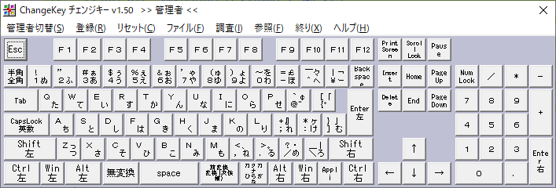
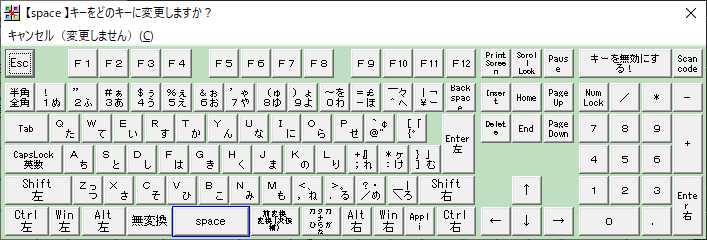
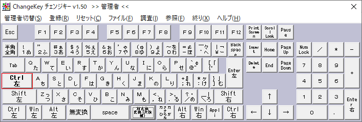
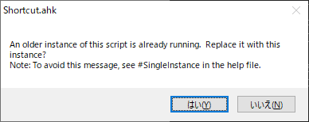
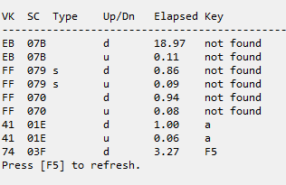
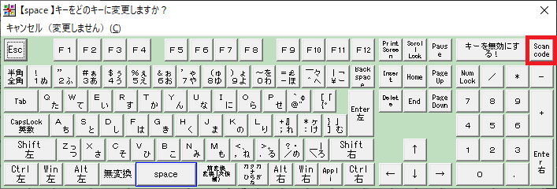
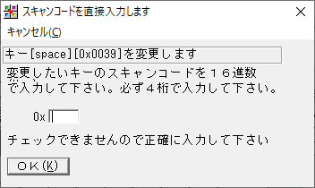
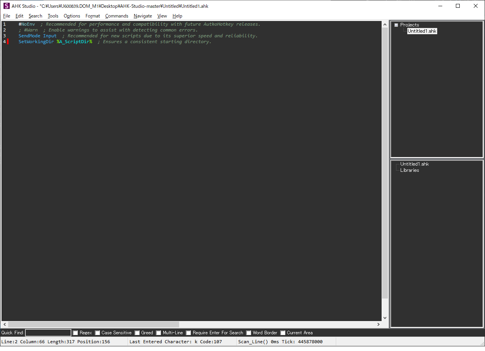

はじめまして。ごまなつと申します。
ご縁がありまして、この度キーバインド設定についての記事を執筆いたします。皆さんにキーバインド設定のやり方と利点を伝えたいと考えております。

## 自己紹介
普段はC#と.NETでWindowsアプリを作成する仕事をしています。趣味では自作キーボードや配列変更をするなど、キーボードに関することやマウスについて調べるのが好きです。

## キーボードに関する不満
唐突ですが、あなたはキーボードに対して不満はありませんか？筆者は、以下のような不満を持っていました。

* （JISキーボードのみ）押しやすい位置にあるがローマ字入力時になかなか使わない：無変換キー、変換キー、カタカナひらがなキー
* 小指を伸ばさないと押せない：Enterキー、BackSpaceキー、IMEキー
* ホームポジションから手が離れる：Escキー、Deleteキー、カーソルキー

これらを解決するために、自作キーボードでキーカスタマイズ！と言いたいところですが、自作キーボードだと全てのキーが難なく入力できるものは3万円前後かかりますし、はんだ付けの手間があります。ですが、キーバインド設定はどのキーボードでも使えて無料ですし、手間が少なく訂正が簡単です。

そこで筆者は、キーバインド設定のソフトを導入しました。キーバインドとは、ホットキー、ショートカットキーと同じような意味で特定のキーの組み合わせで任意の処理を実行する設定です。

筆者はJISキーボードを使用しているため、押しやすい位置にある無変換キー、変換キー、カタカナひらがなキーを用いて、ホームポジションから押せない位置にあるキーを入力できればほとんどホームポジションから手を動かさずに済むようになると考え、実装しました。紹介するソフトは、マウス移動、クリックも設定できます。キーバインドを設定したことで著者の不満は解消され、現在は快適キーボード生活を送れています。

US配列でも、キー同時押しに処理を割り当てることで快適なキーボード操作が可能です。

本記事では、Windowsのキーバインド設定について紹介します。用いるソフトはChangeKeyとAutoHotkeyです。

# ChangeKey
ChangeKeyは、常駐せずにキー割り当てを変更できるフリーソフトです。Windowsの機能として、レジストリを書き換えることでキー割り当てを変更できます。自分でレジストリを書き換えても良いのですが、レジストリ書き換えの場所を間違えるとPCのシステムを破壊することがあるので、このソフトでレジストリ書き換えを代行してもらうと安全です。

まずはじめに、[作者様のHP](http://satoshi3.sakura.ne.jp/f_soft/dw_win.htm)からChangeKeyをダウンロードします。

圧縮形式がLZHなので、LZHファイルを解凍できる解凍ソフトを別にインストールしておいてください。解凍すると、そのフォルダにChgKey.exeがあります。右クリック→管理者として実行をクリックしてください。管理者として実行でないと、うまく動作しません。

起動すると、このような画面になります。


現在の設定が表示されています。変更したいキーをクリックして、開いた画面で設定したいキーをクリックします。



最初の画面に戻り、変更したいキーが設定したキーになっていますが、まだPCに登録がされていません。登録をクリックして、画面の指示に従いPCを再起動すると設定が反映されます。



このソフトによってCapsLockをCtrlに変更したり、普段使わないキーにほかのキーを割り当てることができます。JISキーボードであれば変換キー・無変換キーなどにIMEキー、BackSpaceキー、Enterといった遠いキーをを割り当てると便利です。筆者の設定は以下の通りです。


ですが、ある一つのキー操作をほかの一つのキー操作に変更するのみのため、キーの組み合わせに割り当てたい、キー操作以外の操作を割り当てたい時はAutoHotkeyを用います。

# AutoHotkey
AutoHotkeyは、ショートカットキーを自分で作成するなどキーボードをカスタマイズできるWindows対応のスクリプトエンジンです。トリガーとなるキーの組み合わせや単打、トリガーした後の処理を簡単な文法で設定できます。キーボードのキー入力を別のキーに変更するだけでなく、文字列操作やファイル操作、マウス操作、GUIプログラムの作成、特定ウィンドウでのみ動作、タイマーなど多彩なコマンドが用意されています。

今回は、比較的簡単に設定できるキーの組み合わせで異なるキー入力、マウス操作、別ソフトの起動を行う方法を紹介します。文字列操作やファイル操作、GUI操作などをしたい方はAutoHotkeyのヘルプや公式チュートリアル（[公式サイト](https://www.autohotkey.com/)の下部にリンクがあります。ただし英語です。日本語がいいならAutoHotkey Wiki（http://ahkwiki.net/Top））を参照してください。ただし、AutoHotkey Wikiは2014年で更新が終わっているため、注意が必要です。

最終的には、以下をできるようにしていきます。
* カーソルキー以外で上下左右カーソル移動
* キー操作でマウス移動

まずはじめに、AutoHotkeyをインストールしましょう。[公式サイト](https://autohotkey.com)のDownloadをクリックし、Download Current Versionをクリックしてインストーラをダウンロードします。インストーラを起動して、特にこだわりがなければ「Express Installation」をクリックしてください。

インストール完了後、スクリプトを書いていきます。エディタ（メモ帳でも可）を開き、次の内容を書きます。ファイル名はなんでもいいですが、例ではex1.txtとします。

```
a::b
Rerurn
```

これを保存し、拡張子を.ahkに変更します。すると、緑背景にHが描かれたアイコンに変更され、ダブルクリックで実行できます。実行した後何も起こっていないように思えますが、Windows画面右下のインジケーターにAutoHotkeyのアイコンが表示されています。つまり、バックグラウンドで実行されています。テキストファイルで「a」キーを入力してみてください。「b」が入力されます。AutoHotkeyのスクリプトは、上から順番に実行していき、Returnで処理を終了します。最低一つReturnが無いとエラーになります。基本的には記述の最後に書くことになります。

インジケーターからAutoHotkeyのアイコンのex1.ahkを右クリックしてExitをクリックするとこのスクリプトが終了します。スクリプトが動作しているときのみ設定した処理に変更されるので、テキストファイルで「a」キーを入力すると「a」が入力されます。

これで単打のキー入力変更ができました。次に、複数キーの組み合わせに処理を設定します。ex1.ahkを右クリックして、「Edit This Script」をクリックすると、編集できます。次のように変更します。既に実行しているファイルに対して変更を反映するには右クリックメニューの「Reload This Script」をクリックするか、もう一度ファイルをダブルクリックし、出てくる画面で「はい」を押します。



```
+a::b
Return
```

「a」キーを押すと「a」が入力されます。＋とは何なのでしょうか。これは、Shiftキーです。Shiftキーとaキーの同時押しでbが入力されます。AutoHotkeyでは、修飾キーを記号で表します。修飾キーとは単独では文字入力や制御など具体的な機能を持ちませんが、 他のキーとの組み合わせた時に何らかの機能を発揮させることができるキーのことです。 英語ではmodifier、モディファイアキー、モディファイアと呼ばれます。

```
^ Ctrlキー
! Altキー
+ Shiftキー
# Winキー
```

しかしこれでは、修飾キーとの同時押ししか定義できません（例：aとbの同時押しが定義できない）。そこで、Sendを使います。

Sendは、キーストロークやマウスクリックを発生させたり、文字列を送信するコマンドです。コマンドはプログラムにおける関数のようなものです。今回は特定のキーの組み合わせで特定のキーを送信する設定をします。

```
a & b::Send, ^a
Return
```

「a」と「b」の同時押しで「Ctrl+c」が入力されるようになります。「a & b」に「Send, ^a」を「::」で
割り当てるイメージです。それを確認した後、「a」を押してみてください。「a」が無効化されているのではないでしょうか。このように、Sendで最初に設定したキーが無効化されることがありますので、無効化されても問題ないキーを使いましょう。そんなキーがない？あります。ScrollLockやPauseはなかなか使う人はいないのではないでしょうか。このようなキーを押しやすいキーにChangeKeyで割り当て、そのキーとの同時押しに処理を割り当てると便利です。筆者はChangeKeyで変換キーにScrollLockを割り当て、そのキーとの同時押しに処理を割り当てています。

Send関数では、文字列も送信できますし、連打も定義できます。

```
ScrollLock & s::Send, {a 2} ;2回aを入力
ScrollLock & d::Send, お世話になっております。　；お世話になっております。を入力
```

コメントアウトは「;」で行います。
大文字小文字は区別されます。ここまでできれば、キー操作のキーバインドは実現できます。

## カーソルキー割り当て
次に、カーソルキーを割り当てます。キーの指定ですが、AutoHotkeyはUS配列基準です。US配列には、無変換キーと変換キー、カタカナひらがなキーは存在しません。よって、キーの名前では指定できないため、スキャンコードで指定します。スキャンコードの確認方法は、インジケーターのahkファイルを右クリック→Openをクリックします。開いた画面のView→Key history and script infoをクリックし、スキャンコードを確認したいキーを押した後、F5を押すと、押したキーの履歴が表示されます。



VKの値、scの値、もしくはその両方でもキーを指定することができます。たとえば、スキャンコードでは「a」は「sc02A」、変換キーは「sc079」になります。ちなみに、Typeの行では入力された文字、Up/Dnの行はdがキーを押した/uがキーを離したか、Elapsedがひとつ前との経過時間、Keyがスクリプトの処理が反映されて入力された文字、Windowがどのウィンドウ上の操作だったかです。

「；」「:」「、」「\」の4つのキーは、AutoHotKeyではエスケープシーケンスです。思った通りに動作しなかったり詰まる原因になるので、スキャンコードで指定することをお勧めします。

では、変換キーとjで←を入力してみましょう。

```
sc079 & j::Send, {Blind}{left}
Return
```

これでは動作しなかった方もいると思います。これは、使用しているドライバによっては無変換キー、変換キー、カタカナひらがなキーのスキャンコードをうまくAutoHotkeyが認識できないことがあるからです。動作しなかった方は、先述したChangeKeyを用いて普段使わないキー（ScrollLock、Pauseなど）を変換キーに割り当ててください。他の方法としては、キーボードには存在しないがPCには設定されている仮想キーコードとしてF13～F24キーが存在しています。これを用いる方法もあります。ChangeKeyの変更後のキーを選択する画面で、Scan codeをクリックして調べたスキャンコードを設定します。





すべてのカーソルキーを実装しましょう。

```
ScrollLock & j ::Send, {Blind}{left}
ScrollLock & i ::Send, {Blind}{Up}
ScrollLock & l ::Send, {Blind}{down}
ScrollLock & k ::Send, {Blind}{right}
```

これで同時押しで上下左右に移動できます。left,right,down,rightはそれぞれ左、右、下、上のカーソルキーです。Blindは、Sendコマンドが始まるとき、仮想的に修飾キーを離した状態になり、コマンド終了時に、再びもとの状態に戻される動作を無効化できます。

筆者はゲームでWASD移動に慣れているため、右手も同じ形にしました。横一列のほうが慣れているなら、HJKLに設定すると良いですね。
これでカーソルキーのキーバインド設定ができました。他のキーの組み合わせでもやってみよう、となったとき、AutoHotkey Wikiの[キーリスト](http://ahkwiki.net/KeyList)で指定したいキーの指定方法が確認できます。注意点としては、Sendで送信するキーの指定では特殊キーにあたるものはキー名を｛｝で囲む必要があります。既に意味を持っている記号や単語を区別するためです。^！+#｛｝は囲む必要がある記号です。また、BackSpace、Spaceなど文字列でキーを指定する場合は、｛｝で囲まないとその文字列が送信されてしまいます。

## マウス操作
次に、マウス移動とクリックのマウス操作を実装します。マウス移動はMouseMoveを用います。

```
MouseMove, X,Y, Speed, R

 X, Yは移動先の座標。ディスプレイ左上の座標が（0，0）
 Speedは座標指定時に移動する速度。0～100を設定（0が即時）
 Rがあると座標指定がカーソル位置からの相対座標になる
```

Rを書いていない場合はその座標に移動します。Rを書くと今の座標から指定した座標だけ移動します。細かい移動の設定のみだと大きく移動するときに不便なので、大きく移動する場合も設定します。違和感を感じない速度に設定しましょう。

```
ScrollLock & s:: MouseMove, -11,0,0,R   ;左
ScrollLock & f:: MouseMove, 11,0,0,R    ;右
ScrollLock & e:: MouseMove, 0,-11,0,R   ;上
ScrollLock & d:: MouseMove, 0,11,0,R    ;下

ScrollLock & z:: MouseMove, -400,0,5,R	;左
ScrollLock & v:: MouseMove, 400,0,5,R	;右
ScrollLock & c:: MouseMove, 0,-400,5,R	;上
ScrollLock & x:: MouseMove, 0,400,5,R	;下
```

マウスクリックは、以下のようにします。

```
ScrollLock & w::MouseClick,left       ;左クリック
ScrollLock & r::MouseClick,right      ;右クリック
```

2連打すればダブルクリックになります。2連打、押しっぱなし、も設定できます。

```
MouseClick, WhichButton, X, Y, ClickCount, Speed, D|U, R

 WhichButton(left,right,middle,wheelup,wheeldown)
 X,Yはクリックする座標。ディスプレイ左上の座標が（0，0）で、マウスカーソルも移動する（省略時は現在位置）
 ClickCountはクリックする回数（省略時は1回）
 Speedは座標指定時に移動する速度。0～100を設定（0が即時）（マウス移動が速すぎると不都合が発生するソフトあり）
 D|UはDが押しっぱなし、Uが押下を離す、省略時はクリック
 Rがあると座標指定がカーソル位置からの相対座標になる
```

例では、WhichButton以降すべて省略していますが、他にも記述する場合は、指定したい値が記述法での位置に合うように「,」を足してください。「, ,」と,が複数並ぶこともあります。

## 単語移動とEnter

```
ScrollLock & o::Send, {Blind}^{right}
ScrollLock & u::Send, {Blind}^{left}
```

これで単語移動ができます。Ctrl-→とCtrl-←ですね。

```
ScrollLock & Space::Send, {Blind}{Enter}
```

Enterキーまで小指を伸ばすのがつらく、変換キーとの同時押しにEnterキーを割り当てました。

## 「、」の2連打で「。」を入力

「、」の2連打で「。」が入力できたら楽だと思い、実装しています。この設定は2種類の例を示します。

```
sc033::
If (A_PriorHotKey == A_ThisHotKey and A_TimeSincePriorHotkey < 200)
  {
    Send,{BS}
    Send,{sc034}
  }
else{
    Send,{sc033}
}
Return
```

A_PriorHotKeyは一回前に押したキー、A_ThisHotKeyは今押したキーです。よって、この2つが同じキーだと連打しているとわかります。TimeSincePriorHotkeyはこの2つのキーが押下された時間の差です。連打が200ミリ秒以下だったら、入力された「、」を消すためBackSpaceを一回押して「。」を入力し、そうでなければそのまま「、」を入力するというものです。連打を感知する間隔は変更できます。この設定だと、連打でなく長押しにも反応します。もう一つの例は次です。

```
sc033::
   Keywait, sc033, U ;        1回目のキーが押し上げられるのを待つ
   Keywait, sc033, D T0.2 ;   0.2秒待つ。この間に「、」が押されればErrorLevelに0，そうでないなら1が代入
   If (ErrorLevel=1)        ;直前のコマンド＝Keywaitがタイムアウトで失敗＝1なら
      {
        Send,{sc033}
      }
   else
      {
        Send,{BS}
        Send,{sc034}
      }
   return
```

Keywaitを使って、押下と離す状態を感知して、2回目が押されたら「、」を消すためBackSpaceを一回押し、「。」を入力しています。連打を感知する間隔は変更できます。こちらの設定方法だと、長押しには反応しません。しかし、3行目で指定した待つ時間待たないと「、」が入力されないので、タイピングが速い方は違和感を感じるかもしれません。

好みのほうを使ってください。筆者は前者の設定を使っています。

2連打の設定で注意しなければならないのは、**単押しでそのキーを送信して2連打で他の処理を割り当てるという設定は難しい**ことです。例えば、Escキーに2連打でメモ帳起動、単押しでEsc送信を割り当てたとします。Escキーが押された時の処理はこの一連の処理に設定されており、Escキーの処理ではありません。よって、単押しとして送信されたEscキーをトリガーにまた一連の処理を行い、同時押しした処理が実行されてしまいます。「、」2連打で「。」は、違うキーを押しているので問題ありません。

外部プログラムの起動も設定できます。アプリケーションの起動は次のように書きます。

```
Run, Target, WarkingDir, Max|Min|Hide

 Targetはファイル名、ファイルパス、コマンドラインの文字列、URLを指定
 WarkingDir, Max|Min|Hideは省略可
 WarkingDirは、起動するプログラムの作業ディレクトリを指定。省略時は起動するプログラムの場所
 Max|Min|Hideは起動状態を指定。最大化・最小化・非表示。
```
```
Pause::
  If (A_PriorHotKey == A_ThisHotKey and A_TimeSincePriorHotkey < 300)
  {
    Process,Exist,notepad.exe
    If ErrorLevel <> 0
        WinActivate,ahk_pid %ErrorLevel%   
    else    
        Run, notepad
  }
  else
  {
      Send, ScrollLock
  }
  Return
```

Runの後にアプリケーションのファイルパスを指定すれば任意のエディタが起動できます。前半部分のProcess,Exist, notepadはnotepadというプロセスがあれば最前面に表示し、なければnotepadを起動するというものです。普段使わないPauseキーをトリガーにし、2連打でメモ帳起動、単押しの場合はScrollrockキーを送信しています。

## ホットストリング
ホットストリングは、指定した文字列が入力されたあと終了文字が入力されるとその文字列を削除して設定した文字列を入力するというものです。つまり、置換ですね。デフォルトの終了文字は、-()[]{}':;"/\,.?!{Enter}{Space}{Tab}のいずれかです。追加することもできますし、終了文字を押さなくとも置換を実行することもできます。

```
::btw::by the way
```

btwと入力すると、by the wayに置換されます。英語圏のテキスト入力省力化を想定されているのか、置換後の文字列に2バイト文字を使うことができません。日本語環境では、クリップボードを介して置換することで実装できます。

```
::kita-::
Clipboard = ｷﾀ━━━━━━(ﾟ∀ﾟ)━━━━━━ !!!!!
Send,^v
Return
```

終了文字を押さずとも置換を実行するなどの設定は、最初の::の間にオプションを設定します。*を書くことで終了文字なしで置換を実行します。

```
:*:Kt-::
Clipboard = ｷﾀ━━━━━━(ﾟ∀ﾟ)━━━━━━ !!!!!
Send,^v
Return
```

日本語環境でホットストリングを使用する注意点としては、次のものがあります。

 * テキスト入力欄以外でも置換を実行するので予期せぬ動作をする可能性がある
 * IMEが有効でも動作し、ひらがなに変換されおかしくなる。また、未確定文字列の数が英語と異なるため、余分に自動削除される。そのため、Kt-のように先頭を大文字で母音を含まない文字列にし、オプションにCを入れ大文字小文字を区別するようにすると安全
 * 文字列の上限は40文字
 * 複数のホットストリングにマッチした場合は先に指定されたものが優先される

このホットストリング機能でスクリプトを書くこともできます。

```
:*:exmprun::
   Run, http://example.com/
   Return
```
ブラウザを起動して、指定したURLを開けます。example.comは例として用いたURLなので、使うときは自分が開きたいWebページのURLを設定してください。テキスト入力欄でなくても実行することを逆手に取ります。このように、ショートカットキー代わりに使うこともできます。

## ファイル分割
キーバインド設定を増やしていくなかで、1つのファイルにすべて書いていると巨大なファイルになりメンテナンスしにくくなります。そのため、いくつかのファイルに分割したくなります。分割した後、ahkファイルをひとつずつ実行しているとインジケーターが雑多になるし、設定OFFにしたいときにひとつずつ終了するのは手間です。1つのahkファイルに、他のahkファイルを起動する設定を書きましょう。

```
#Include %A_ScriptDir%/hoge.ahk
#Include %A_ScriptDir%/huga.ahk
Return
```

%A_ScriptDir%はこのファイルがあるファイルパスです。このファイルに書いた起動したいファイルを、このファイルと同じ場所に置くのが分かりやすいです。

## AHK-Studio
コーディングをするときは統合開発環境（IDE）を使うことが増えてきました。IDEの利点の一つに、シンタックスハイライト、補完があります。これがあると便利ですよね。AutoHotkeyにも、シンタックスハイライト、補完ができるソフトがあります。それが、AHK-Studioです。全てのahkファイルを切り替えて編集できますので、自分で設定を複数作ってみようと考えた方は是非使ってください。

[作者様のGithubリポジトリ](https://github.com/maestrith/AHK-Studio)から、Clone or downloadをクリックしDownload ZIPでダウンロード、解凍してAHK-Studio.ahkを実行してください。



## おわりに
ChangeKeyによるキー割り当て変更、AutoHotkeyによるキー割り当て変更、キーバインド設定、マウス操作が可能になりました。筆者が使用しているキーボードは変換キーがちょうど親指の位置にあるスペースキーが小さいキーボードなので変換キーをトリガーにする設定になっています。使っているキーボードだけでなく使用者の好み・タイピング方法によって使いやすい設定は異なるので、ぜひ自分にあった設定をみつけてください。
他にもAutoHotkeyでは普通に押した場合と長押しで処理を変えたり、特定のウィンドウでのみ動作する設定をしたり、タイマー設定、ループ、一定時間待機もできるので調べればいろいろなことができます。ぜひ、自分好みの設定を作り出してください。


