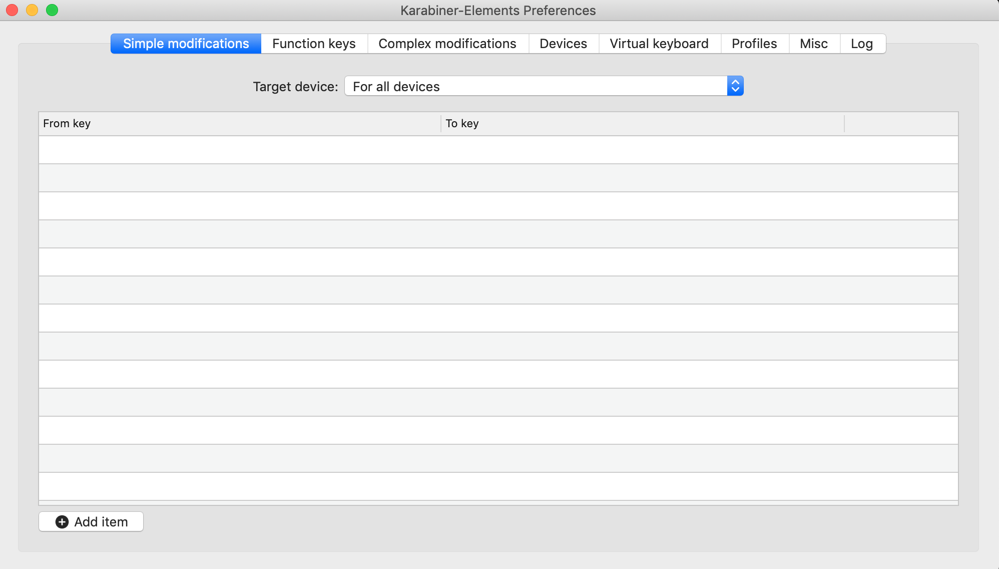
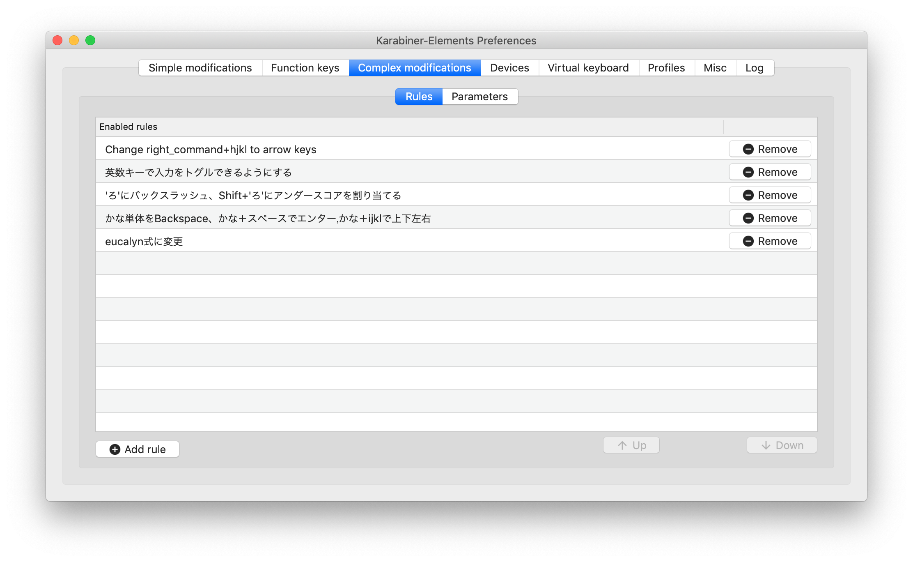
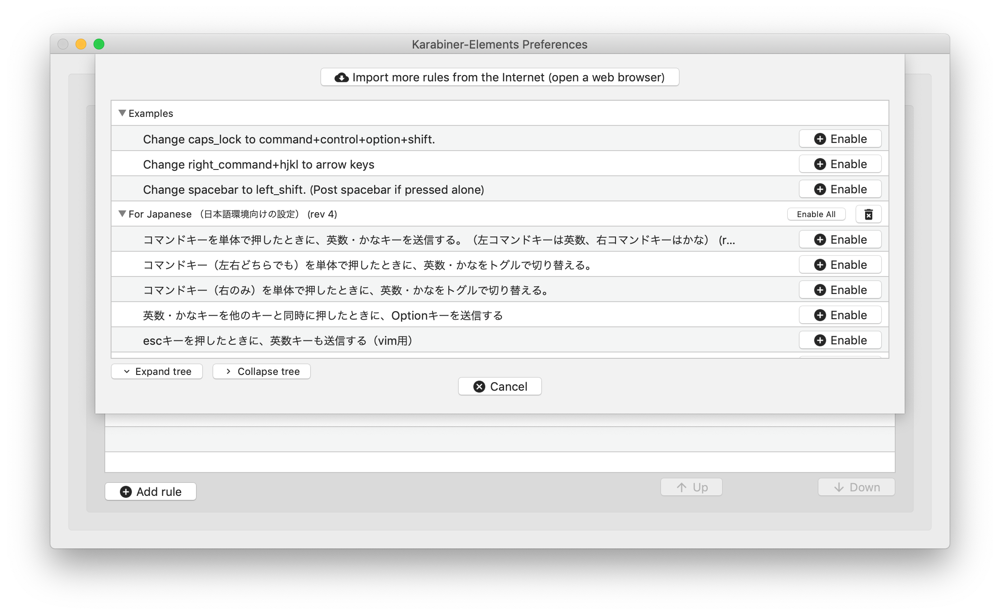
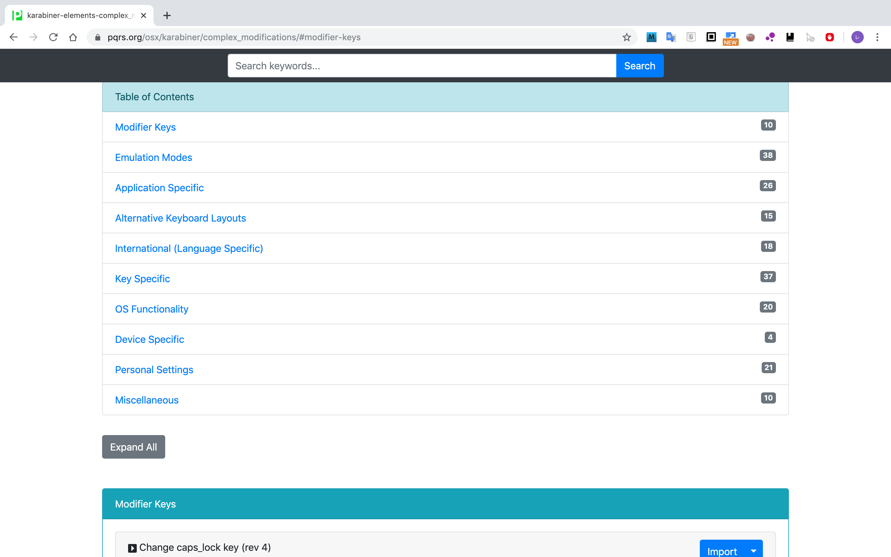
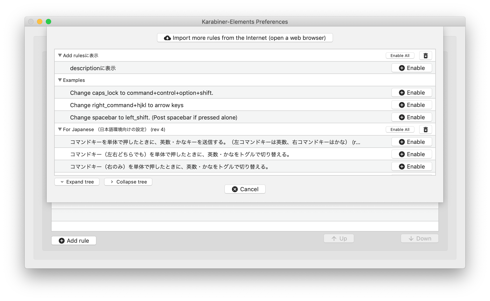

ごまなつと申します。キーバインド設定で快適なキーボード操作をするお手伝いをいたします。
本記事では、Macのキーバインド設定について紹介します。用いるソフトはKarabiner-Elementsです。Karabiner-ElementsはmacOS Sierra以降に対応しています。Sierra未満の方はKarabinerを使ってください。

# Karabiner-Elementsとは
Karabiner-Elementsとは、Sierra以降のmacOSのキーボードをカスタマイズするためのツールです。Sierraからキーボードドライバの構成が変更されたため、Karabiner-Elementsが開発されました（それより前はKarabinerが開発されていました）。この記事では、Karabiner-Elementsを扱います。

キーマップの変更はもちろん可能です。既存で用意されている設定をインポートすることができ、その中に主要エディタのショートカットキー（Vim, Emacs, Visual Studio Code）がありとても簡単に設定できます。独自で設定することもでき、キーの組み合わせで他のキー入力や、マウス操作、キーバインド設定ができます。設定のインポート方法、独自設定の設定方法を紹介します。

# 実際にキーバインド設定してみよう
まず、[公式サイト](https://pqrs.org/osx/karabiner/)からインストールします。設定は変更せずインストール完了まで進めてください。Karabiner-Elementsの設定は~/.config/karabiner/karabiner.jsonに保存されます。Karabiner-Elementsを起動すると、このような画面が出ます。


Simple Modificationsでは、一つのキー入力を他の一つのキー入力に変更できます。具体的にはFrom keyの入力をTo keyの入力に変換できます。キーマップ変更ですね。Add itemをクリックして、新たなルールを設定してください。消したい場合は、右側のRemoveをクリックしてください。

# 既存設定のインポート
Complex Modificationsでは、主要エディタのショートカットキー設定（Vim, Emacs, Visual Studio Codeなど）といった既存の設定がインポートするだけで使うことができます。独自設定も追加でき、追加する場合は複数キーの組み合わせを扱え、押しっぱなしといった複雑なルールも扱うことができます。



上の画面は、現在設定しているルールの一覧画面です。Add ruleをクリックすると、下の画面が開きます。現在設定できるルールが表示されます（インポートした設定と独自設定したもの）。


Import more rules from the internet(open a web browser) をクリックすると、インポート可能なキーバインド設定の一覧が表示されているサイトが立ち上がります。



追加したいキーバインド設定のImportをクリックして、インポートが完了すると、現在設定できるルールの画面に戻ります。インポートした設定が追加されており、Enableで実際に設定してそのルールを使うことができます。

# 独自設定
キーバインド設定をするなら、自分に合った独自のキーバインド設定をしたいですよね。Karabiner-Elementsでも独自キーバインド設定ができます。キーバインド設定は、~/.config/karabiner/assets/complex_modificationsに保存されます。（インポートした設定は数列.jsonというファイル名で保存されています。例：1566313435.json）

Karabiner-Elementsの現在設定できるルール一覧はこのディレクトリのjsonファイルを読み込んでいるため、自分でjsonファイルを作成すると読み込まれます。現在設定できるルールの一覧から、Enableをクリックして現在の設定に追加してください。設定ファイル名は英数字内で自由なのですが、ごくたまに読み込まれないことがあります。その際はファイル名を数列.jsonとしてください。また、jsonファイル内容の形式が正しくなかった場合も読み込まれません。

JSONとはJavaScript Object Notationの略で、テキストベースのデータフォーマットです。主要なプログラミング言語にはjsonの生成や読み込みを行うライブラリが存在しているため、データ交換のためのデータフォーマットとして利用されます。

```
{
  "key":"value",
  "key2":"value2",
  "key3":[true, 123, "value3"]
}
```

まず、全体を{ }で囲む必要があります。キーと値を：で区切って並べて書きます。キーと値の組み合わせが複数にわたる場合は「,」で区切って並べます。値は、文字列は""で囲み、数値とbool値はそのまま、配列は要素を「,」で区切り、[ ]で囲みます。{ }でも[ ]でも、最後の要素に「,」は要らないです。閉じ括弧の前には「,」はいらないということです。

見やすいように改行することが多いですが、すべてを1行で書くこともできます。括弧の数を間違えがち（開いた括弧を閉じていない）なので、改行して括弧の中身を一段階インデントし、見やすくすることが多いです。

それでは、jsonファイルの中身を見ていきましょう。

```
{
  "title": "Add rulesに表示させる",
  "rules": [
    {
      "description": "descriptionを表示させる"
    }
  ]
}
```

Karabiner-ElementsのRule追加画面に表示される部分です。titleに設定した文字列が表示され、その中にdescriptionが各項目の設定として表示されています。



既に実行されている設定ファイルを編集後、変更を反映させるにはComplex Modifications→Rulesで対象のルールをRemoveして、Add rulesで再度ルールを適用してください。

## 設定の基本構造
rulesは配列になっているので、１つのrulesの中に複数のdescription以下の設定を記述できます。titleの中に複数の設定が表示されていましたよね。また、１つのdescriptionの中に複数の設定をすることもできます。

```
"title"
"rules"
  "description"
  "manipulators"
    "type"      //1つ目の設定
    "from"
    "to"
    "type"      //2つ目の設定
    "from"
    "to"
```

コメントは、キーを増やしても問題ないので"comment"のキーを作成する方法があります。

```
"comment": "このキーを増やしてもよく、コメントが書ける"
```

キーバインド設定の記述に入ります。基本としては、fromで設定したキー入力を受け付けたら、toで設定したキー入力に変更するというものです。

設定全体の注意点として、fromに設定した入力は、通常の動作をせずここで設定した入力をすることに注意してください。もう、fromに設定した入力はtoの処理しかしないということです。ちなみに、toになにも設定しないと何もしないのでfromに設定したキーを無効化します。また、単純にfrom、toに1つのキーを設定した場合は、キーマップの変更になります。
## from
### type
typeには、基本的には"basic"を指定します。マウスの動きをスクロールに変換したい場合のみ"mouse_motion_to_scroll"を指定します。この機能を使う場合は、Karabiner-ElementsのDevicesで、自分が使っているマウスにチェックを入れておく必要があります。

```
{
  "description": "Change control + mouse motion to scroll wheel (rev 1)",
  "available_since": "12.3.0",
  "manipulators": [
    {
      "type": "mouse_motion_to_scroll",
      "from": {
        "modifiers": {
          "mandatory": [
            "control"
          ]
        }
      }
    }
  ]
}
```

この例は、Controlキーを押しながらマウスを動かすと、動かした方向にスクロールするようになります。

ここからの説明では、"title"/"rules"/"description"/"manipulators"/"type"の直接関係ない部分は省略してサンプルを載せていきます。ここからの設定は、全てtypeは"basic"です。

### modifiers 
```
"type":"basic"
"from":{
  "key_code":"j"
  "modifiers":{
    "mandatory":["control"]
  }
"to":[
  {"key_code":"left_arrow"}
 ]
```

control-jの組み合わせを指定しています。例の"controll"部分にanyを指定（"mandatory":["any"]）すると、全てのキー入力を指定します。キー入力ではなくマウスのボタンを指定する時は、key_codeではなく"pointing_button":"button3"のように指定してください。modifiersはキーの組み合わせを指定します。ここでは、mandatoryとoptionalがあります。

mandatoryはキーの組み合わせを指定します。この組み合わせが入力されたときに"to"の処理を行います。mandatoryには、修飾キーのcommand, control, shift, option, fn, caps_lock, anyのどれかを設定することをお勧めします。これら以外だと、mandatoryに指定したキーを押しながらkey_codeに指定したキーを押した場合のみ動作するので、mandatoryに指定したキーの入力が少なくとも1回入ってしまいます。

"pointing_button"はbutton1が左クリック、button2が右クリック、button3がホイールクリックです。注意点として、これらのボタンの単体押しをfromの処理に割り当てると、そのクリックは元々のクリックとして使えなくなります。modifiersを用いて同時押しの一部に使いましょう。（例：from{"pointing_button":"button1"}とすると、左クリックは左クリックを検知するとtoの処理をするボタンになる。元々の左クリックの機能はなくなる）

"optional"に指定したキーは、"to"の時にも引き継がれます。"any"だと、全てのキー入力を引き継ぎます。ちなみに、Shift、controlなど左右に存在しているキーは、left_controlのようにすると左右区別できます。left、rightを書いていない場合は、どちらでも受け付けます。

```
"from":{
  "modifiers":{
    "mandatory":["control"],
    "optional":["any"]
  }
},
"to":[
    {"key_code":"command"}
]
```

controlと何かのキー入力を受け付けると、commandと押したキーを送信するといったものです。この例では、commandの同時押しはcommandをcontrolに置き換えて送信されるという設定です。デフォルトキーバインドはcommandに割り当てられていますが、controlでもできるようになると便利ですよね。

"caps_lock"を指定すると、CapsLockがON状態でも変換を実行するようになります。Karabiner-Elementsは、CapsLockがONの時CapsLockが押されていると判断しています。

注意点として、"mandatory"と"optional"に同じキーを指定すると引き継ぎできなくなります。

### simultaneous
"simultaneous"は、複数キーの同時押しに何らかの処理を割り当てたいときに使います。同時押しの許容時間は、Complex Modifications→Parameters→simultaneous_threshold_millisecondsで設定できます。デフォルトでは、50ミリ秒になっています。"modifiers"は両方押されている状態を検知したとき、"simultaneous"は指定した時間内に同時押しを検知したときに発火します。

```
{
  "manipulators": [
    {
      "type": "basic",
      "from": {
        "simultaneous": [
          { "key_code": "j" },
          { "key_code": "k" },
          { "key_code": "l" }
        ]
      },
      "to": [
        { "shell_command": "open -a TextEdit" }
      ]
    }
  ]
}
```

jklの同時押しでテキストエディタを起動します。simultaneousの下のfrom内に、オプションを書けます。simultaneousのオプションには、この5つがあります。

```
"detect_key_down_uninterruptedly",
"key_down_order",
"key_up_order",
"key_up_when",
"to_after_key_up"
```

 * "detect_key_down_uninterruptedly"
 ** trueかfalseで指定します。trueだと、同時押しの途中に違うキーを押しても、同時押しに設定された操作の変換を行った後、違うキーを押します。falseだと、変換処理に入りません。上の例だと、jkslと押した場合、jklを押した動作をした後、sが入力されます。省略した場合はfalseです。
 * "key_down_order"
 ** "strict","strict_inverse","insensitive"のどれかで指定します。キーが押される順番を明確に決めて発火させる設定です。"strict"が記述した順番、"strict_inverse"が記述と反対の順番です。"insensitive"は、順番を問わなくなります。省略した場合は"insensitive"です。
 * "key_up_order"
 ** "strict","strict_inverse","insensitive"のどれかで指定します。key_up_orderを指定すると、指定キーを押した時点では変換されず、いずれかのキーを一つ離した時点で発火します。"strict"だと"simultaneous"で最初に記述したキー、"strict_inverse"だと最後に記述したキー、"insensitive"だと記述したどのキーを離しても発火します。省略した場合は"insensitive"です。
 * "key_up_when"
 ** "all"か"any"を指定します。同時押しした全てのキーを離したことにするタイミングを設定します。"all"だとすべて離したとき、"any"だとどれか一つを離した時点で記述した全てのキーを離したことにします。
 * "to_after_key_up"
 ** 同時押ししたキーを離した時点で処理を行いたい場合に設定します。例えば、次で指定するような変数を用いた処理に使います。

```
"simultaneous_options": {
  "to_after_key_up": [
    { "set_variable": { "name": "hogehoge", "value": 0 } }
  ]
  },
  "to": [
    { "set_variable": { "name": "hogehoge", "value": 1 } }
  ]
}
```
"set_variable"で代入ができます。このようにすれば、押したときに"value"を1、離したときに0にできます。

## to
キーの指定方法に関しては"from"と同様です。配列なので、複数の処理を設定できます。

```
"to":[
  {"key_code":"a"}
]
```
fromの設定が発火したらaを押すことができます。

```
"to":[
  {"key_code":"a"}
  {"key_code":"japanese_eisuu"}
  {"key_code":"a"}
]
```

fromの設定が発火したらaを2回とjapanese_eisuuを押すことができます。"pointing_button"も指定できます。

```
{
"to": [
  { "pointing_button": "button1" },
  { "pointing_button": "button1" }
]
```

button1は左クリックですのでfromのキー操作にダブルクリックを割り当てることができます。

```
"to": [
  { "shell_command": "open -a TextEdit" }
]
```

キーの組み合わせにシェルコマンドを割り当てることができます。打ち込むコマンドにエスケープシーケンスが含まれる場合は「\」でエスケープ処理をする必要があります。

```
"to": [
  {
    "key_code": "down_arrow",
    "modifiers": ["command", "shift"]
    "lazy":true
  }
]
```

同時押しです。"modifiers"は、"from"の場合とは異なり"mandatory"、"optional"の設定は不要です。"lazy":true とすると、変換が実行されるタイミングが"from"が発火したタイミングではなく"from"が発火したキーを押しながら他のキーを押したタイミングになります。

### IME変更
```
"to": [
  {
    "select_input_source": {
      "input_source_id": "^com\\.apple\\.inputmethod\\.Kotoeri\\.Japanese$"
    }
  }
```
```
"to": [
  {
    "select_input_source": {
      "input_source_id": "^com\\.apple\\.inputmethod\\.Kotoeri\\.Roman$"
    }
  }
]
```

"select_input_source"の"input_source_id"に特定の値を指定することでIMEの状態を指定することができます。IMEは特殊キーなので、値を確認します。Karabiner-ElementsのEventViewer→variablesでキーを押したときの値を見ることができます。

アップル日本語入力や、Google日本語入力など入力方式で値が変わります。input_source_identifiersの項目で"input_source_id"の値を確認してください。この例ではアップル日本語入力です。

この方法では、アップル日本語入力やGoogle日本語入力といった入力方式まで扱いますが、英数入力とかな入力を切り替えるだけであればもっと簡単にできます。（後述する特定IMEを参照。）

### mouse_key
"mouse_key"を使うと、マウス移動、ホイールスクロールを割り当てられます。クリックは"from"の時と同様に"pointing_button"で割り当てます。

```
"to": [ 
        { "mouse_key": { "x": -10 }} ,
        { "mouse_key": { "y": -10 }}
]
```

```
"to": [
  { "mouse_key": { "horizontal_wheel": 64 }}
]
```

x,yは座標のことなので、xが横方向（正で右、負で左）、yが縦方向（正で下、負で上）移動です。ホイールは、"horizontal_wheel"は左右のスクロール（正で右、負で左）、"vertical_wheel"は上下のスクロール（正で下、負で上）です。クリックは先述の"pointing_button"を使ってください。

### 条件指定
```
"from": {
  "key_code": "left_command",
  "modifiers": {
    "optional": [ "any" ]
  }
},
"to": [
  {"key_code": "left_command"}
],
"parameters": {
  "basic.to_if_alone_timeout_milliseconds": 2000,
},
"to_if_alone": [
  {"key_code": "japanese_eisuu"}
]
```

"to_if_alone"は、単独で押したときのみ、設定に変換するというものです。この例は、左Commandキーを単独で押した場合は英数キーとして認識し、他のキーと組み合わせて押すと左Command-押したキーとして認識する設定です。この例では、2000ミリ秒押し続けると、英数への変換はキャンセルされます。

```
"from": {
  "key_code": "x",
  "modifiers": { "mandatory": [ "control" ] }
},
"to": [ { "set_variable": { "name": "ctrl-x", "value": 1 } } ],
"to_delayed_action": {
  "to_if_invoked": [
     { "set_variable": { "name": "ctrl-x", "value": 2 } } 
   ],
  "to_if_canceled": [
     { "set_variable": { "name": "ctrl-x", "value": 0 } } 
   ]
}
```

"to_delayed_action"は、一定時間待った後の処理や、コマンドがキャンセルされた時の処理を設定できます。この例では、ctrl-xを押すと"ctrl-x"に1を代入します。そのまま何も押さないと2を代入します。ctrl-xに続けて何か別のキーを押すと0が代入されます。"to_if_invoked"が実行されるまでの時間はComplex Modifications→Parametersで指定できます。これをどのように使うかというと、Emacsなどにある"ctrl-x ctrl-s"のキーバインド設定をするために使います。後述する"condition"を使って実装します。

```
"to_after_key_up": [
  {"set_variable": { "name": "enthumble_mode","value": 0 } }
]
```

"to_after_key_up"は、"from"で設定したキーから手を離したときに実行する処理を書きます。設定した変数の値を変更するのによく使います。

```
"from": {
  "key_code": "q",
  "modifiers": { "mandatory": [ "command" ] }
},
"parameters": { "basic.to_if_held_down_threshold_milliseconds": 1000 },
"to_if_held_down": [
  { 
    "key_code": "q",
    "modifiers": [ "command" ],
    "repeat": false
  }
]
```

"to_if_held_down"は、"from"で設定したキーを指定した時間押し続けたときに実行する処理を書きます。この時間はデフォルトでは500ミリ秒です。設定画面のComplex Modifications→parametersで変更できますが、これだと全てのルールに適用されます。"description"ごとに設定する場合は、"parameters"/"basic.to_if_held_down_threshold_milliseconds"に設定します。
"repeat"をtrueに指定すると、処理が実行され続けます。
command-qは楽ですが、押し続けると閉じる必要のないアプリケーションを閉じてしまいます。例では、1秒間押し続けないとcommand-qの処理を実行しないようにしています。

#### conditions
"conditions"は、一定の条件を満たすときのみに処理を行いたいときに指定する項目です。

 * device_if、devece_unless
 ** 特定のキーボードの時、特定のキーボードでないときを条件にしたい場合は、　"identifiers"に、"vendor_id"と"product_id"を指定します。"vendor_id"と"product_id"は、Karabiner-ElementsのDevicesタブで確認できます。

```
"conditions": [
  {
    "type": "device_if",
    "identifiers": [
      {
        "vendor_id": 12345,
        "product_id": 12345
        }
    ]
  }
]
```

 * frontmost_application_if、frontmost_application_unless
 ** 特定のアプリの時、特定のアプリでないときを条件にしたい場合は、アプリを指定します。アプリの名称は"karabiner-EventViewer"で調べるか、シェルで osascript -e 'id of app "(調べたいアプリの名称)"' コマンドを実行して調べます。"karabiner-EventViewer"で調べるには"karabiner-EventViewer"を立ち上げて、調べたいアプリを開くとFrontmost Application画面にアプリの名称が表示されます。アプリの名称は、正規表現でも指定できます。

```
"conditions": [
  {
    "type": "frontmost_application_if",
    "bundle_identifiers": [ "^com\\.apple\\.Safari" ]
  }
]
```

 * variable_if、variable_unless
    * 変数が特定の値の時、特定の値以外の時を条件にしたい場合は、押した時と離したときに異なる数値を"set_variable"で設定して条件に使います。
```
"from": {
  "key_code": "japanese_eisuu",
},
"to": [
  {
    "set_variable": {    
      "name": "mode", "value": 1
    }
  }
],
"to_after_key_up": [
  {
    "set_variable": {
      "name": "mode", "value": 0
    }
  }
],
},
{
"type": "basic",
"from": {
  "key_code": "h",
},
"to": [
  { "key_code": "left_arrow" }
],
"conditions": [
  {
    "type": "variable_if",
    "name": "mode", 
    "value": 1
  }
]
```
英数キーを押したときに1、離したときに0を設定し、Hを押したときmode変数が1ということは英数キーが押しっぱなしなので英数キーを押しながらHを押したときに"left_arrow"に変換します。

 * input_source_if、input_source_unless
 ** IMEが指定した状態の時、指定した状態でないときを条件にしたいときに使います。同じキーを押したときにIMEの状態によって処理内容を変更したい場合に使います。

```
{
  "type": "basic",
  "from": { "key_code": "Japanese_eisuu" },
  "to": [{"key_code": "Japanese_kana"}],
  "conditions": [
    {
      "type": "input_source_if",
      "input_sources": [{ "language": "en" }]
    }
  ]
},
```

英数入力になっているときは、英数キーでかな入力に変更するという設定にすれば、英数キーでIMEをトグル設定にできます。

## 2連打に処理を割り当てる方法
ここまでの設定の紹介では思いつきにくいですが便利な設定である、キーの2連打に処理を割り当てる方法を紹介します。"set_variable"による変数の値変更で"condition"の条件判定を用いて実現します。

```
"manipulators": [
    {
      "type": "basic",
      "from": { "key_code": "left_control" },
      "to": [
        { "shell_command": "open -a 'safari'" }
      ],
      "conditions": [
        { "type": "variable_if", "name": "left_control_key", "value": 1 }
      ]
    },
    {
      "type": "basic",
      "from": {
        "key_code": "left_control",
        "modifiers": { "optional": [ "any" ] }
      },
      "to": [
        { "set_variable": { "name": "left_control_key", "value": 1 } },
        { "key_code": "left_control" }
      ],
      "to_delayed_action": {
        "to_if_invoked": [
          { "set_variable": { "name": "left_control_key", "value": 0 } }
        ],
        "to_if_canceled": [
          { "set_variable": { "name": "left_control_key", "value": 0 } }
        ]
      },
      "conditions": [
        { "type": "variable_if", "name": "left_control_key", "value": 0 }
      ]
    }
  ]
```

safariを起動する設定です。前半部分はvalueが1のときに実行するので、1回目に押したときは読み飛ばします。後半部分は、左のコントロールが押された時にvalueを1にして、指定した時間何もしなければ0、他のキーが押されたら0にします。2連打したときはvalueが1のため、前半部分を実行します。という仕組みです。これを文章の入力に使用するときは工夫が必要です。たとえば、「、」キーを2回押すと「。」を入力する設定は、一回目の「、」が入力されてしまいます。なので、消す必要があります。

```
{
  "description": "Double tap 'keypad_period' to 'comma'",
  "manipulators": [
    {
      "type": "basic",
      "from": { "key_code": "keypad_period" },
      "to": [
        { "key_code": "delete_or_backspace"},
        { "key_code": "comma" },
        { "set_variable": { "name": "press_period_key", "value": 0 } }
      ],
      "conditions": [
        { "type": "variable_if", "name": "press_period_key", "value": 1 }
      ]
    },
    {
      "type": "basic",
      "from": { "key_code": "keypad_period" },
      "to": [
        { "set_variable": { "name": "press_period_key", "value": 1 } },
        { "key_code": "keypad_period" }
      ],
      "to_delayed_action": {
        "to_if_invoked": [
          { "set_variable": { "name": "press_period_key", "value": 0 } }
        ],
        "to_if_canceled": [
          { "set_variable": { "name": "press_period_key", "value": 0 } }
        ]
      },
      "conditions": [
        { "type": "variable_if", "name": "press_period_key", "value": 0 }
      ]
    }
  ]
}
```

前半部分にBackSpaceを一回押す処理を入れたことで2連打するとピリオドが打てたように見えるというものです。

## JISキーボードを使っていて、記号の割り当てがおかしいとき
Karabiner-Elementsが、JISキーボードをUSキーボードと認識することがあります。そのため、JISキーボードに見えている記号を入力してもKarabiner-ElementsはUSキーボードのその位置の記号だと認識することがあります。この時、キーボードの認識を合わせるよう頑張るか、Karabiner-Elementsの認識に合わせて設定をすることになります。JISキーボードとUSキーボードの記号の対応表を掲載しておくので、参考にしてください。

|JISキーボード|	USキーボード|指定すべきキーコード|
|------------|-------------|---------------------|
|^	|=	|equal_sign|  
|¥	|なし|	international3|  
|@	|[	|open_bracket|
|[	|]	|close_bracket|
|:	|'	|quote|
|]	|\	|backslash|
|\	|..|international1|
|;	|;	|semicolon|
|-	|-	|hyphen|
|,	|,	|comma|
|..|なし|period|
|/	|/	|slash|

JISキーボードの見た目のキーを打つ設定をするときに、指定すべきキーコードで指定してください。たとえば、「:」キーで何か処理をするときは、{key_code:quote}にするということです。

## 筆者が行っている設定
筆者が行っている設定方法を紹介します。紹介しているものもあるので、設定方法は割愛させていただきます。変換キーを押しながらikjlで上下左右カーソル、edsfで上下左右マウス移動、wrで左右クリック、SpaceキーでEnterにします。変換キーの単押しはBackSpaceです。英数キーをIMEキーのトグル設定にし、「,」の2回押しで「.」を入力しています。筆者はメインがWindowsPCのため、WindowsPCでAutoHotkeyによって設定していた設定をそのまま移植しました。

## 終わりに
この記事を読むことによって、Karabiner-Elementsによるキー割り当て変更、キーバインド設定、マウス操作がいろいろな条件の時に設定可能になりました。使っているキーボードだけでなく使用者の好み・タイピング方法によって使いやすい設定は異なるので、ぜひ自分にあった設定を見つけてください。