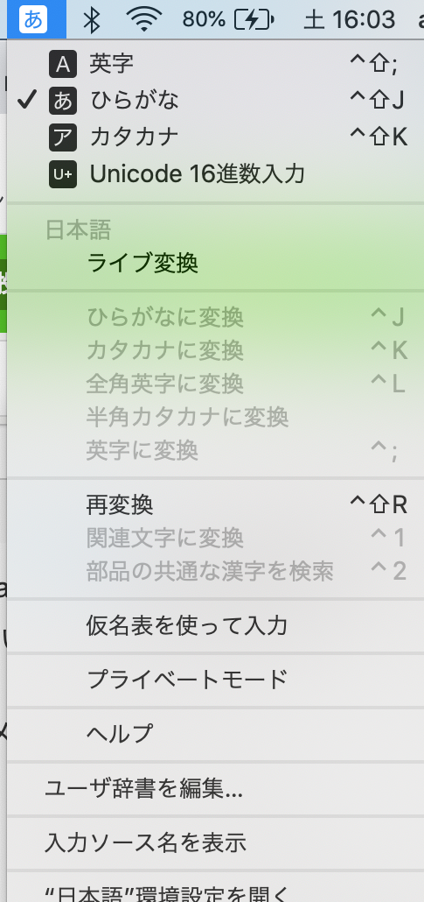

ごまなつと申します。キーバインド設定で快適なキーボード操作をするお手伝いをいたします。前回はWindowsのIMEの解説をしました。今回は、MacのIMEの解説をします。Macでは、ショートカットキーを使って操作できるのが良い点です。

# IMEメニュー
MacのIMEのアイコンは、メニューバーのステータスメニューにある黒字に白抜きの「A」や「あ」が書いてあるものです。クリックしてみましょう。


英字、ひらがな、カタカナ、Unicode１６進変換は現在の入力方式を切り替えます。英数キー、かなキーを押しても切り替わります。Unicode１６進変換は、直接Unicodeの値を入力することで文字を入力できます。ヒエログリフなど特殊なフォントはUnicode１６進変換でしか入力できないです。Unicode１６進変換が表示されていない場合もあります。表示する方法は後述します。

「ライブ変換」はMac独自の機能で、文章を入力すると入力を確定する前に自動で変換を進める機能です。WindowsからMacに移行した人にとっては困惑の種になることが多いですが、慣れると便利な機能です。選択することでオンとオフが切り替わります。

「ひらがなに変換」、「カタカナに変換」、「全角英字に変換」、「半角カタカナに変換」、「英字に変換」は文章を入力してまだ確定していない状態（下線が出ている状態）で選択でき、それぞれに変換できます。

「再変換」では、入力を確定した単語を再び変換することができます。範囲選択していない状態では近くの単語を再変換し、単語を範囲選択するとその単語を再変換することができます。この操作はかなキーを２度押しすることでもできます。勢い余って変換ミスを入力しても、かなキーを２度押しすれば再変換できるので使いこなせると便利です。

「関連文字に変換」では、変換したい漢字を選択して、関連文字に変換できます。代表的なものは旧字体です。例として、人名の「渡辺」さんを入力したけれども、旧字体の渡邊さんだったとき、画像のように辺を選択して関連文字に変換すると変換することができます。


「部品の共通な漢字を検索」では、部品の共通な漢字を変換候補として選択できます。対象の漢字を選択して、部品の共通な漢字に変換できます。次の例では邊を選択したので、しんにょうの漢字が表示されています。


ここまでの内容で、ライブ変換以外はメニューの右端に記号があることにお気づきでしょうか。これはショートカットキーです。「＾」がcontrolキー,「上矢印（Mac環境依存）」がShiftキーです(このマークはキーボードにも印字されています)。ショートカットキーを使って操作するとかなり便利です。入力切り替えが押しやすい位置のショートカットキーに設定されているのは便利ですね。

「仮名表を使って入力」は、ソフトウェアキーボードです。クリックしたボタンの文字が入力されます。

「プライベートモード」は、プライベートモードの間は入力履歴が残らず変換学習もされない状態となり、今までの変換学習内容を使用しなくなります。変換候補には、今まで入力された内容から学習して、予測された変換候補が出てきます。これにより、普段入力している内容が他人に推測される可能性があります。プライベートモードにしている間は入力内容が学習に含まれなくなります。入力履歴をリセットする方法もあります。

「ユーザ辞書を編集」では、辞書を編集できます。入力に指定した内容の変換候補に表示される内容に、変換に登録した内容を表示できます。ダブルクリックして入力するか、下の「＋」をクリックして追加、「-」をクリックして削除することができます。

「入力ソース名を表示」をクリックすると、IMEのアイコンの横に現在の入力方式が表示されるようになります。

# システム環境設定→キーボード
「”日本語”環境設定を開く」は、「システム環境設定」→「キーボード」の「入力ソース」タブをクリックしたときの画面が表示されます。

##　入力ソースタブ
使用する入力モード、Caps Lockの動作、Shiftキーの動作、入力方法を変更できます。WindowsではCaps LockとShiftは一時的に英字を入力するものですが、Macでは一時的にカタカナ入力にできます。また、ライブ変換のオンオフ、タイプミスを修正、Windows風のキー操作にするかを設定できます。

「候補表示」では、推測候補のフォントとフォントサイズ、推測候補表示するか、句読点で変換するか雪堤できます。句読点で変換は、「、」か「。」を入力した時に入力内容を変換します。

「英字のレイアウト」は、入力配列を変更できます。QWERTY配列がデフォルトですが、各国の配列、Dvorak、Colemakも選択できます。

「句読点の種類」は、「、」「，」、「。」「．」の組み合わせをそれぞれ選択できます。

"/"キーで入力する文字は"・"か"/","¥"キーで入力する文字は"¥"か"\"を選択できます。

「書類ごとに入力ソースを自動的に切り替える」は、使用しているアプリケーションごとに最後に入力した入力方式を憶えるようになります。例えばコードエディタとメールアプリを切り替えたときに毎回入力方式を変更する必要がありますが、この設定をすると切替が不要になります。

先に述べたUnicode16進変換を表示する方法は、この画面の左下の「＋」をクリックし、Unicodeと検索するか最下部の「その他」の中のUnicode16進変換を選択して追加します。

## キーボードタブ
「メニューバーにキーボードビューアと絵文字ビューワを表示」は、メニューに２つの項目が追加されます。

「絵文字と記号を表示」をクリックすると、文字ビューアが開きます。絵文字や記号を検索して、クリックすると入力することができます。また、文字ビューアに選択状態の文字をドラッグ＆ドロップすることで、文字の情報が表示されます。この情報の中から、その文字のUnicodeを知ることができます。

「キーボードビューワ」をクリックすると、この画面が開きます。ソフトウェアキーボードですとしても使用できますが、押されたキーが赤い四角で囲まれます。キーが効いているか確認に使えます。

「F1、F2などのキーを標準のファンクションキーとして使用」は、チェックが入っているとファンクションキーとして使用する際にはFnキーを同時押しする必要があります。例えば、F1は単体押しだとディスプレイの輝度が下がります。チェックを外すとFnキー同時押しと単体押しの操作が入れ替わります。

「キーボードの種類を変更...」は、接続している外部キーボードのUS/JIS/ANSIを切り替えることができます。JIS配列のキーボードを接続したのにUS配列で認識された場合に使うことがあります。このボタンが存在しない場合は、直接起動することもできます。パスは、次です。

```
/System/Library/CoreServices/KeyboardSetupAssistant.app
```

「修飾キー...」はCaps Lockキー/Controlキー/Optionキー/Commandキー/ファンクションキーを押したときの操作をこれらのキーとEscキーから選べます。これにより、位置を入れ替えることができます。この設定はキーボードごとに設定します。

「ユーザ辞書」は「ユーザ辞書の編集」と同じです。

# ショートカットキータブ
表示されている操作のショートカットキーを変更できます。Caps Lockキー/Controlキー/Optionキー/Commandキー/と何らかのキー一つの同時押しを設定できます。方向キーは単体で設定できます。すでに設定されている組み合わせを設定するとこのようになり、修正できます。
[ショートカットキー](images6/shortcut.png)
音声入力タブは音声入力のオンオフを設定できます。言語と音声入力を開始するショートカットを設定できます。音声入力をする方法は設定したショートカットキーを押すか、入力しているソフトの編集タブの音声入力を開始をクリックします。

# まとめ
MacでのIME設定を解説しました。Windowsに比べるとショートカットキーを設定できたり、直接変換のショートカットキーがFキーではなく手の位置をほとんど動かす必要がないなど使いやすさという点をよく考えられていると思います。便利な設定を用いて、自分に最適なIME設定をしていきましょう。

