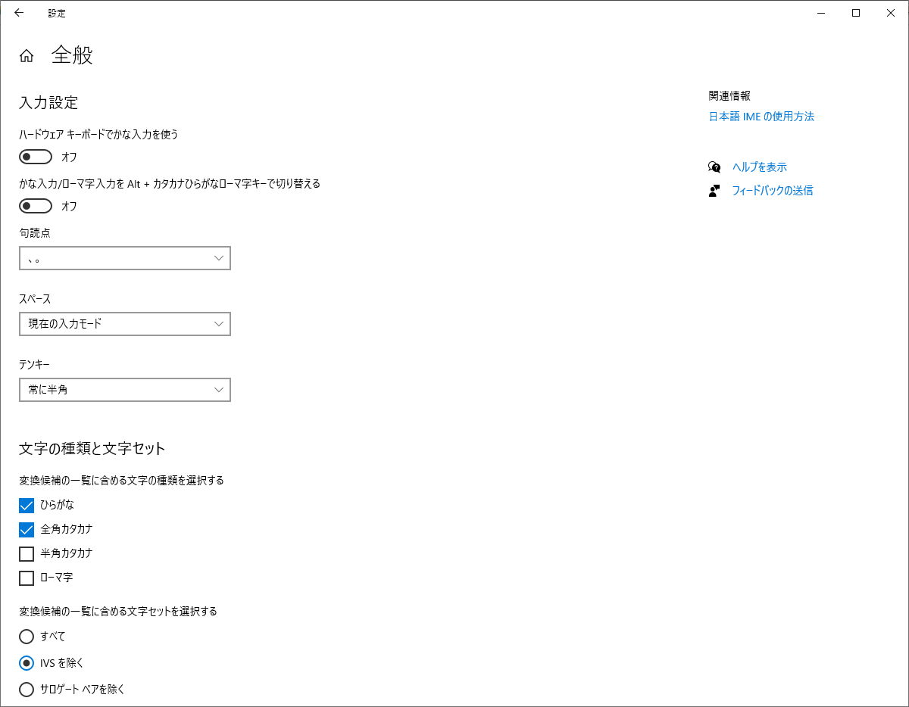
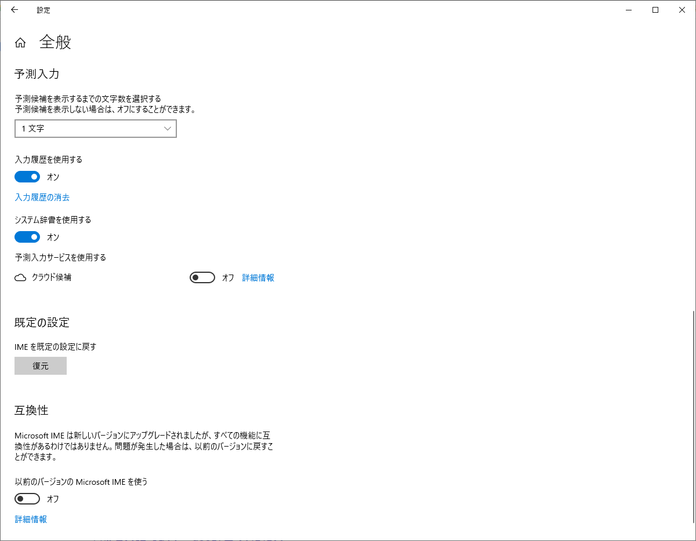
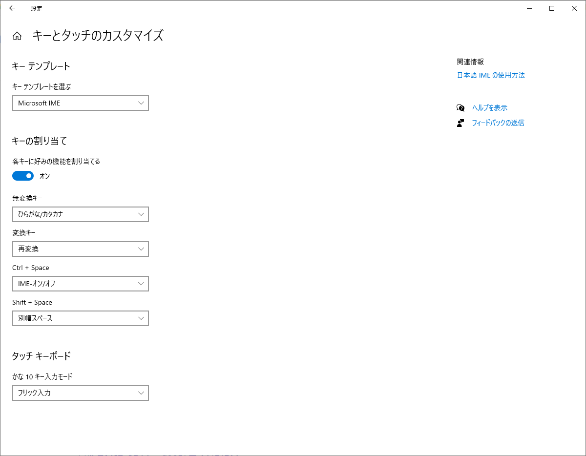
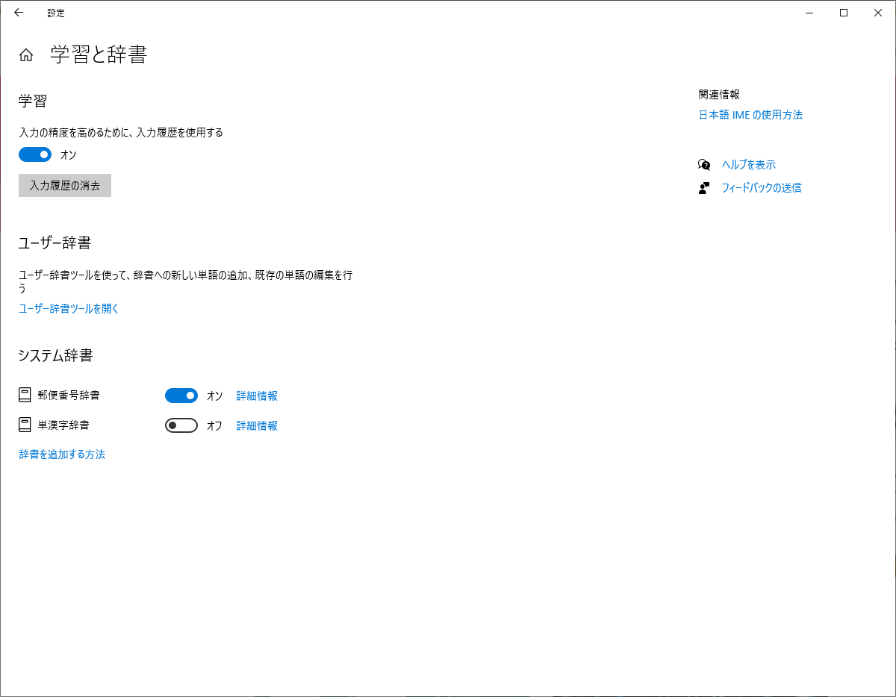
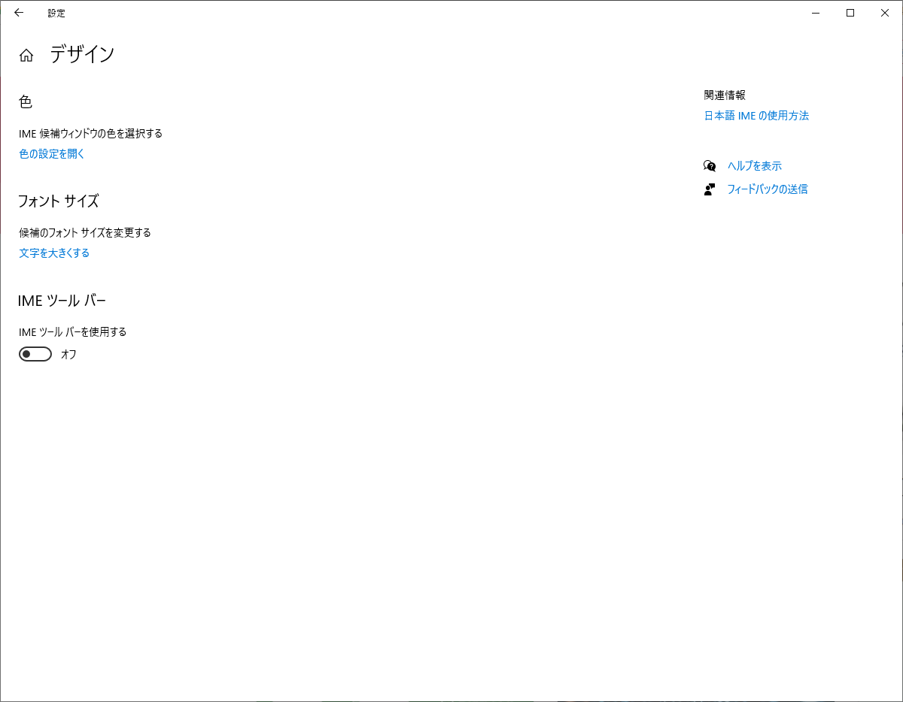
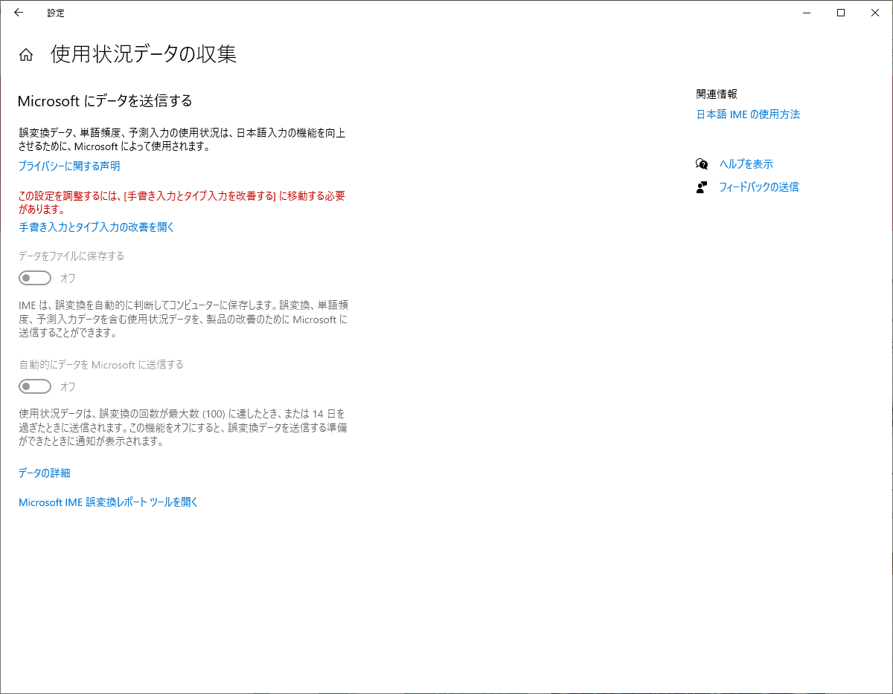

ごまなつと申します。快適なキーボード操作をするお手伝いをいたします。以前、WindowsのIMEの解説をしましたが、IME設定がWindowsの設定画面に移動しました。今回は、そのIMEの解説をします。以前は設定変更のために多くの手順を踏むことになっていましたが、ウィンドウではなくWindowsの設定画面を使うことで非常にシンプルにわかりやすくなりました。よく使う項目に絞られており、一画面で表示されることでストレスなく変更できます。以前のIME設定を使いたい方は、その方法も解説します。[以前のIME設定解説記事](https://knowledge.sakura.ad.jp/27066/)も併せて参考にしてください。

# 設定画面
では、IMEオプションを開くため時刻と音量アイコンの間にある「あ」や「A」を右クリックしましょう。設定をクリックします。

見慣れたWindowsの設定画面が出てきましたね。Windowsの設定画面を使うように変更されたため、以下の画面になりました。

Windowsの設定画面から開きたい場合は、時刻と言語→左メニューの言語→優先する言語の中の日本語→オプション→キーボードの中のMicrosoft IME→オプションをクリックします。

## 全般

ハードウェアキーボードでのかな入力のオンオフ、かな入力とローマ字の切り替えをカタカナひらがなローマ字キーで切り替える機能のオンオフ、句読点の設定、スペースの幅、テンキーの全角半角を切り替えられます。文字の種類と文字セットでは、変換候補の一覧に含める文字の設定ができます。

予測入力では、予測候補を表示するまでの文字数を変更できます。今まで、１文字目で予測候補が表示され煩わしいと思っている方は、２文字目、３文字目にするとよいです。入力履歴を使うかどうかや削除、予測入力サービスを使うかを設定できます。

加えて、既定の設定の復元と、以前のバージョンのMicrosoftIMEを使う設定もできます。以前のバージョンのMicrosoftIMEを使うをオンにすると、最下部に詳細設定が出現し、詳細設定を開くをクリックすると以前のIME設定画面を開くことができます。シンプルにはなりましたが、以前のIME設定だとIMEのON/OFを別のキーに割り当てる際、多くの選択肢があるため必要であれば以前の設定を用いるのも手です。

注意点として、以前のバージョンのMicrosoftIMEを使うをオンにするとほかの項目で表示されなくなるものがあります（例：キーとタッチのカスタマイズのキーの割り当て）。また、時刻と音量アイコンの間にある「あ」や「A」を右クリックした時のメニューの項目も以前のIME設定に変化します。

## キーとタッチのカスタマイズ

キーテンプレートの選択、キーの割り当て、タッチキーボードの設定ができます。キーの割り当ては、以前は変換前や変換後といったタイミングを指定して処理を設定したうえ、設定できるキーが多くあり一目で理解しづらかったです。ですが今回は、タイミングの指定はなくなり、無変換キー・変換キー・Ctrl+Space・Shift+Spaceの4つに絞られたことでとても分かりやすいです。無変換キーはIMEオン/オフのトグルとオン、オフ、ひらがなカタカナキーが設定できます。また、変換キーはIMEオン/オフのトグルとオン、オフ、再変換が設定できます。Ctrl+SpaceはIMEオン/オフのトグル、なし、Shift+Spaceは別幅スペース、IMEオン/オフのトグル、なしが設定できます。この機能を使わない場合は、各キーに好みの機能を割り当てるをオフにしてください。

タッチキーボードでは、フリック入力とマルチタップ入力か、フリック入力が選択できます。

## 学習と辞書

変換ミス履歴を使ってIMEが学習します。その機能を使うかどうかの設定、ユーザ辞書・システム辞書の設定ができます。システム辞書が一覧表示となり、とても見やすくなりました。基本的には以前のIMEと同じため割愛します。

## デザイン

色の設定、フォントサイズの設定、IMEツールバーの使用が設定できます。色の設定とフォントサイズの設定はWindowsの設定の別画面に飛びます。

## 使用状況データの収集

Microsoftにデータを送信するか、データをファイルに保存するか、自動的にデータをMicrosoftに送信するか設定できます。筆者のPCでは診断データを送信しないようにしているためこのような画面になっています。

# まとめ
Windowsの新IME設定を解説しました。以前のIME設定は多機能ではありますが項目が多くわかりにくい点がありました。新IME設定では、よく使われる項目に絞ってシンプルになったため簡単に操作できます。キーの割り当てでIMEのON/OFF切り替えを無変換キー・変換キー・Ctrl+Space・Shift+Spaceの4つのどれかに割り当てるだけでもかなり便利です。筆者は、何らかの方法（キーボードのプリセット機能、AutoHotkey、ChangeKey、レジストリ書き換え）でCapsLockとCtrlを入れ替えたうえでCtrl+Spaceを使っておりかなり便利です。ぜひやってみてください。